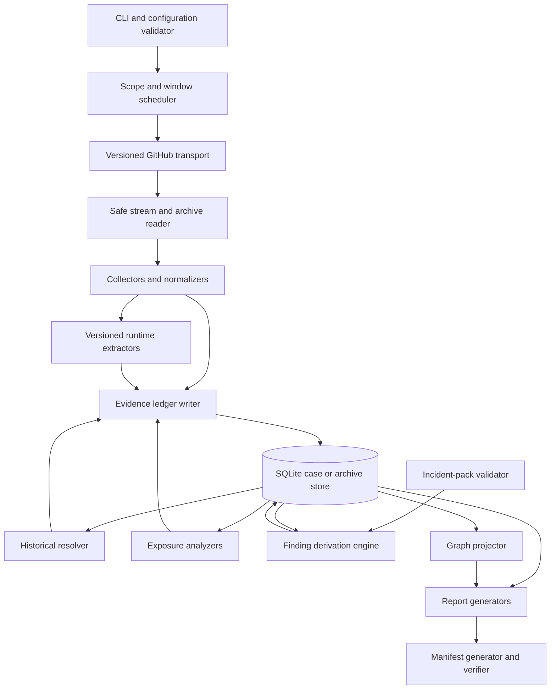
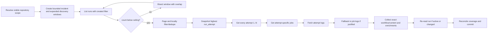
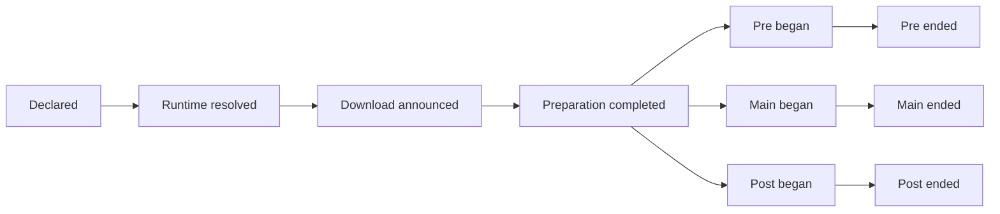
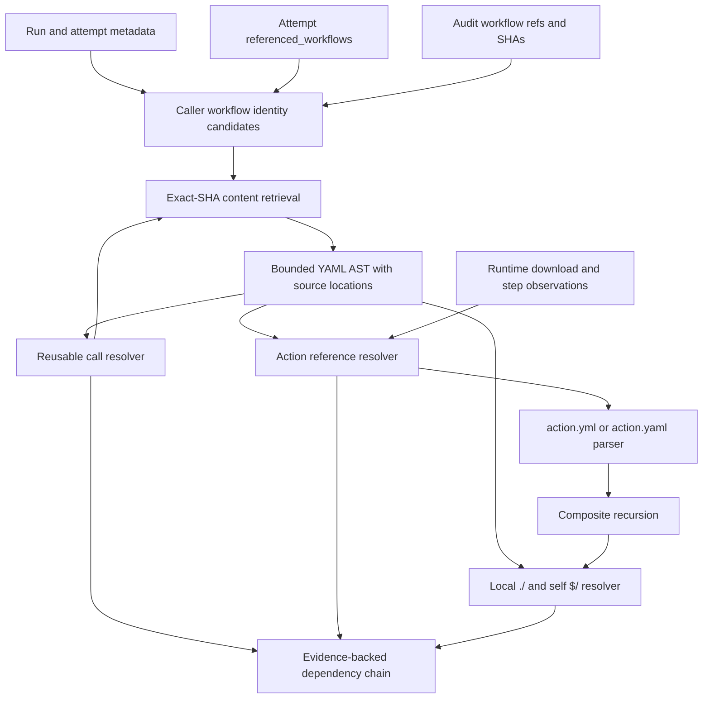
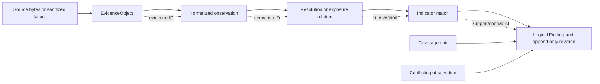
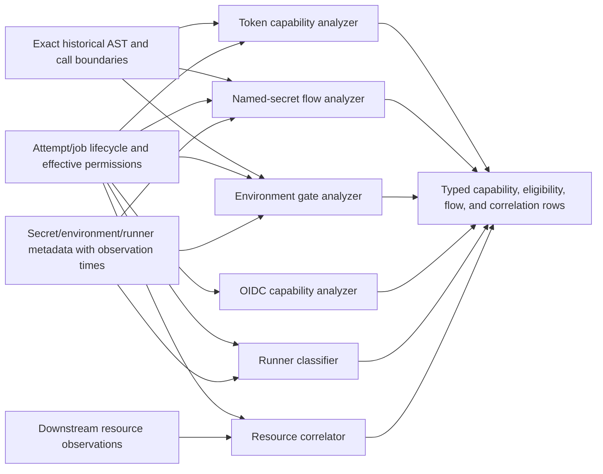
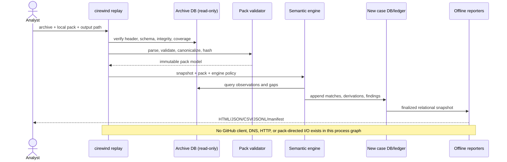
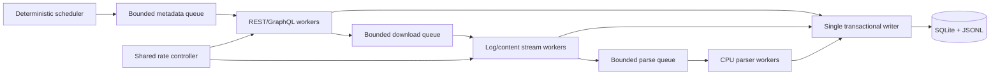
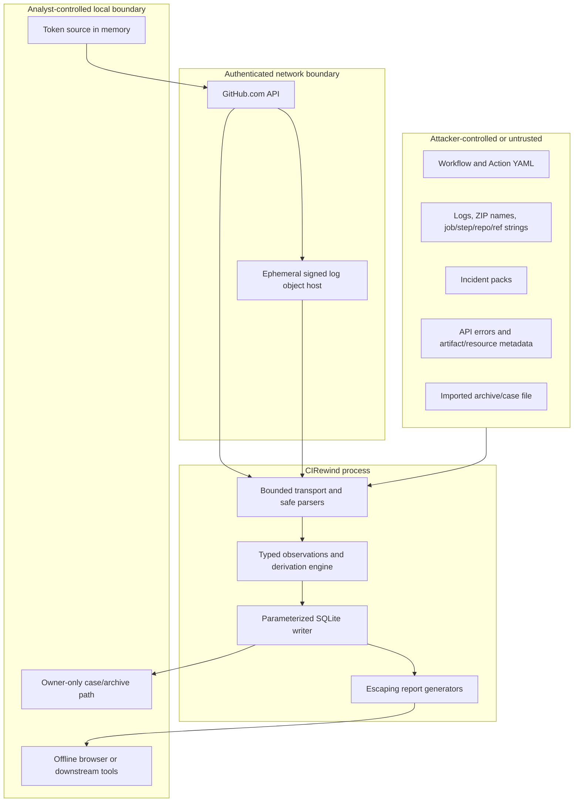
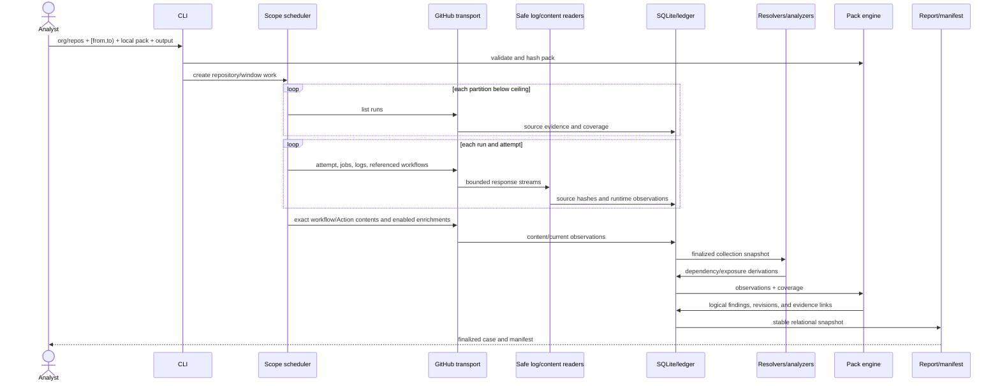

# CIRewind architecture

Status: v0.1 implementation contract; release qualification incomplete
Planning date: 2026-08-20
Normative semantics: [EVIDENCE_MODEL.md](EVIDENCE_MODEL.md)
Endpoint contract: [GITHUB_DATA_SOURCES.md](GITHUB_DATA_SOURCES.md)
Security limits: [THREAT_MODEL.md](THREAT_MODEL.md)

Current implementation and validation coverage are tracked separately in
[IMPLEMENTATION_STATUS.md](IMPLEMENTATION_STATUS.md). Descriptions here remain
normative design requirements. The status page may identify an unimplemented or
unvalidated boundary, but it does not weaken this contract.

## Architectural objectives

CIRewind is a local, read-only GitHub collector and offline evidence-analysis system. One Go CLI should be statically distributable where the provisional pure-Go SQLite dependency passes the feasibility spike. SQLite and the append-only JSONL ledger are the persisted sources of truth. HTML and the graph are derived products.

The architecture must make these properties difficult to violate accidentally:

- No conclusion crosses an attempt boundary unless the output is an explicit aggregation of attempt-level findings.
- Collection, parsing, resolution, incident matching, and reporting are separate stages with separate evidence IDs.
- Runtime observations outrank configuration inference, but contradictory lower-level evidence is retained.
- Missing evidence is stored as evidence about coverage; it is not represented by an empty result.
- Fetched workflows and Actions are data. The process never checks out, imports, builds, sources, or executes them.
- Replay has no GitHub transport dependency and must be operable with networking disabled.
- All nondeterministic inputs—clock, API version, parser version, policy, pack bytes, and scope—are recorded.

## Component architecture

### Responsibility boundaries

| Component | Accepts | Emits | Forbidden behavior |
| --- | --- | --- | --- |
| CLI/configuration | Arguments, environment, config file | Immutable validated configuration | Printing tokens; accepting pack-supplied flags |
| Scope scheduler | Repository set, explicitly bounded incident windows, provisional 65-day discovery horizon, collection watermarks | Deterministically keyed work units | Declaring completeness without coverage reconciliation |
| GitHub transport | Fixed GitHub.com endpoint descriptor and typed parameters | Hashed response stream or typed failure | Arbitrary pack URLs; forwarding authorization to redirect hosts |
| Safe reader | Bounded HTTP/ZIP/YAML/text bytes | Validated streams and structural diagnostics | Filesystem extraction of source ZIP paths; recursive archive execution |
| Collector/normalizer | API-specific responses | Source observations and normalized rows | Final incident conclusions |
| Runtime extractor | Log entry stream and grammar version | Exact observations with source spans | Treating a download as execution; scanning for secret values |
| Historical resolver | Definitions, references, runtime resolutions | Dependency nodes, edges, ambiguities | Resolving a historical mutable ref from its current target |
| Exposure analyzer | Jobs, AST, permissions, audit/environment/resource facts | Capability, eligibility, flow, and correlation records | Claiming credential use, secret possession, cloud assumption, or causation without evidence |
| Pack validator | Local pack bytes and policy | Canonical pack and hash | Network, shell, templates, HTML, or unbounded regex |
| Finding engine | Canonical pack, observations, coverage | Ten-state findings and derivations | Numeric risk score as the primary conclusion |
| Store/ledger | Typed records | Durable transactional rows and append-only JSONL | Dynamic SQL from hostile values; token persistence |
| Reporter/graph | Finalized database | Escaped offline files | Remote assets or evidence-free material edges |

## Operating modes

All modes use the same schemas and semantic engine.

| Mode | Network allowed | Writes | Analysis |
| --- | --- | --- | --- |
| `investigate` | Yes, fixed GitHub.com APIs only | New case directory and optional raw objects | During/after collection using supplied pack |
| `archive` | Yes, fixed GitHub.com APIs only | Incremental archive transaction log and compact observations | No incident required; extract everything needed for later matching |
| `replay` | No | New case directory; source archive opened read-only | Supplied pack over archived observations |
| `pack validate` | No | None unless an explicit canonical-output option is later designed | Schema/safety/canonicalization only |

An implementation may share code, but replay must construct no GitHub client and tests must fail if it attempts DNS, HTTP, or process execution.

## Collection pipeline

### Repository scope

The scheduler stores the requested scope separately from the visible scope. An organization request is complete only if repository enumeration succeeded under authority that is expected to see all repositories. Public-only or partial membership results must not be labeled organization-complete. Explicit repositories retain their input name and resolved immutable repository ID so renames do not collapse identity.

### Recursive time-window partitioning

**Verified fact:** GitHub's workflow-run list supports a `created` qualifier and returns at most 1,000 results for a filtered search. The documented page size maximum is 100 ([REST workflow-run endpoints](https://docs.github.com/en/rest/actions/workflow-runs?apiVersion=2026-03-10), retrieved 2026-08-20).

**Design decision:** the `investigate --from/--to` command scope is a half-open collection interval `[from, to)`; component windows inside a pack retain their own explicit bounds and precision. GitHub separately documents rerun eligibility through day 30 and a maximum 35-day workflow-run lifetime including waiting and approval, but does not say whether that lifetime is anchored to original parent creation across later attempts. Until the spike proves that anchor, the parent-run discovery interval and archive watch use the conservative combined bound `[from - 65 days, to)`. Exposure evaluation still uses the most specific attempt/job/step/log event time and the pack window's declared bounds, never parent `created_at` alone. A 35-day optimization requires captured proof and an ADR update ([rerun documentation](https://docs.github.com/en/actions/how-tos/manage-workflow-runs/re-run-workflows-and-jobs) and [Actions limits](https://docs.github.com/en/actions/reference/limits), retrieved 2026-08-20).

Because the API range syntax may be inclusive at both ends, CIRewind queries overlapping closed ranges, locally applies the discovery interval, and deduplicates by immutable repository ID plus run ID.

Partition algorithm:

1. Query a repository/window with `per_page=1` and retain the reported count and response evidence.
2. Split whenever the reported count is **greater than or equal to** 1,000; equality is not trusted as proof that only 1,000 exist.
3. Bisect on UTC whole-second boundaries. Include the split boundary in both API queries, then locally assign a run to exactly one half.
4. Stop splitting only below the ceiling. Page to exhaustion and verify page/link behavior and that every returned `created_at` is locally in range.
5. Deduplicate by repository ID/run ID, retaining duplicate source observations as derivations rather than duplicate runs.
6. If a one-second leaf still reports at least 1,000, emit a `DENSITY_CEILING` coverage gap. Use audit-log run IDs as an optional independently sourced supplement when authorized; do not call the leaf complete merely because 1,000 rows were returned.

The spike must test whether `total_count` itself is capped or approximate. The conservative split-at-equality rule remains even if the test reports exact counts.

### Attempt snapshot and live-run races

**Verified fact:** the run representation includes `run_attempt`; REST provides `GET /repos/{owner}/{repo}/actions/runs/{run_id}/attempts/{attempt_number}`, attempt-log download, and attempt-specific job listing. Reruns keep the original `GITHUB_SHA` and `GITHUB_REF` and use the original triggering actor's privileges; full and partial reusable-workflow reruns have different mutable-ref behavior ([rerun documentation](https://docs.github.com/en/actions/how-tos/manage-workflow-runs/re-run-workflows-and-jobs) and [reusable-workflow reference](https://docs.github.com/en/actions/reference/workflows-and-actions/reusing-workflow-configurations), retrieved 2026-08-20).

Collection rules:

1. Record the initial run response and `N = run_attempt`.
2. Request each attempt `1..N`; never synthesize an older attempt from the latest run response.
3. Request jobs through the attempt-specific route and retain job IDs. A job is keyed by repository, run, attempt, and job ID even if GitHub job IDs appear globally unique.
4. Fetch the attempt ZIP immediately after receiving its one-minute redirect; store only the API route and a sanitized redirect-host observation, never signed query parameters.
5. If the attempt ZIP cannot be obtained, request each known job log as a fallback. The two sources remain distinct evidence objects.
6. Re-read the run if it was not terminal or if collection took long enough for a rerun race. Collect newly observed attempts until two snapshots agree or the configured stabilization limit is reached. A changing run after that limit creates a `LIVE_STATE_RACE` gap.
7. Failed-job and single-job reruns may omit jobs that were not rerun. Absence from an attempt is modeled as `NOT_SCHEDULED_IN_ATTEMPT` only when live fixtures prove that API behavior; otherwise it remains unknown.

Full/failed/single rerun type is stored only when directly exposed or uniquely inferred from attempt job membership. The inference and its evidence must be retained.

### HTTP and redirect contract

- Send a pinned `X-GitHub-Api-Version` recorded in collection metadata.
- Hash response entity bytes while streaming, before parsing; also hash any retained compact payload.
- Record method, route template, canonical non-secret parameters, response status, relevant rate headers, media type, byte count, request start/end, and collection time.
- Never record request headers, bearer tokens, signed redirect queries, cookies, or raw authorization errors.
- Follow no general redirects. A log-download endpoint may yield one immediate HTTPS signed-object redirect under the policy validated in the spike. Strip authorization and cookies before the second request; do not follow another redirect.
- On an expired log link, request a new link from GitHub once the rate/retry controller permits. Never blindly retry the signed URL.
- Bound body bytes even when `Content-Length` is absent or misleading.

### Runtime preparation and execution extraction

The extractor records facts in a monotonic state machine; it does not collapse every setup line into “downloaded”:

Observations may be absent, duplicated, fail, or contradict another source; a later observation does not cause CIRewind to invent a missing timestamp. The three lifecycle branches are independent evidence dimensions—the diagram does not require main before post or even an observed main at all. A runner announcement precedes the actual download, so it is resolution/intent evidence only. `CONFIRMED_DOWNLOADED` requires `PreparationCompleted` or a stronger validated preparation-completion signal. `CONFIRMED_EXECUTED` requires exact same-attempt runtime resolution joined to a structurally correlated main, pre, or post begin event for the affected Action; a workflow step's display name or ordinal alone is insufficient. Each observation retains its log source span, parser grammar/version, attempt/job key, phase, and time precision.

Action preparation can cover a step whose `if` later skips, and pre/main/post handlers are separate lifecycle phases. Current GitHub.com also supports background and parallel `run`/`uses` steps. Therefore YAML order and API step number are not general happens-before relations: store per-step intervals and explicit wait/cancel/synchronization edges, and leave overlapping unsynchronized steps unordered. See the normative rules and sources in [EVIDENCE_MODEL.md](EVIDENCE_MODEL.md#runtime-reconstruction-and-downloaded-versus-executed-semantics).

## Historical-resolution pipeline

### Workflow-definition identity priority

`head_sha` is never a universal workflow-definition identifier. Candidate sources are stored independently and compared:

| Priority | Source | Meaning | Constraint |
| --- | --- | --- | --- |
| 1 | Exact executed caller file from GraphQL `WorkflowRun.file.repositoryFileUrl` | Candidate authoritative caller definition | Spike must prove the URL is commit-immutable and behavior across prior attempts/events |
| 1 | Unambiguously correlated `workflows.prepared_workflow_job.calling_workflow_shas` / `job_workflow_ref` | Exact workflow chain for a started job | Optional audit authority; event may lack job ID/attempt, so correlation can fail |
| 1 | Attempt REST `referenced_workflows[].sha` | Exact called reusable-workflow SHA recorded by GitHub | Called workflows only; request each attempt |
| 2 | Event-specific documented `GITHUB_SHA`/ref plus repository content | Strong caller candidate for event classes validated in lab | Store as inference unless the API says it is the executed workflow file |
| 3 | Historical ref lookup with evidence that the ref was fixed | Declaration candidate | Never use today's mutable target as historical resolution |
| 4 | Current default-branch content | Current reference only | Can support only `CURRENT_REFERENCE_ONLY` |

If two priority-1 sources materially disagree for the same attempt/job, preserve both and create contradiction evidence. Do not choose one silently.

### YAML parser contract

The parser operates on an AST, not an object mapper that loses duplicate keys, tags, source spans, aliases, or scalar spelling. It must:

- Enforce document bytes, node count, nesting, alias, scalar, and expression length limits.
- Reject duplicate mapping keys in incident packs; record duplicate/ambiguous keys as a workflow parse gap rather than applying last-key-wins.
- Preserve path and byte/line spans for every `uses`, `if`, `permissions`, `environment`, `env`, `with`, `secrets`, matrix, and trigger field.
- Treat interpolated/dynamic `uses` expressions as unresolved. It must not evaluate arbitrary expressions.
- Parse only the restricted expression shapes needed to find secret references and known matrix substitutions. Any unknown function/context yields an explicit dynamic-reference gap.
- Normalize repository owner/name case for matching while retaining original spelling.
- Never expand file includes or fetch YAML-directed resources.

### Resolution contexts

Every reference is resolved with an explicit context tuple:

| Field | Purpose |
| --- | --- |
| Containing repository ID/name | `$/` and nested ownership |
| Containing definition path | Source provenance and local relative rules |
| Containing definition Git object ID | Exact `$/` binding and historical fetch |
| Caller repository/trigger SHA | Reusable workflow execution context and checkout candidate |
| Workspace checkout state | `./` resolution, which is runner-workspace based |
| Run/attempt/job/step key | Prevent cross-attempt correlation |
| Declared ref and runtime-resolved SHA/digest | Preserve declaration/runtime distinction |
| Event and relevant timestamps | Incident-window matching |

### Repository Actions

For `owner/repo[/subpath]@ref`, the resolver records the declaration as an `ActionRef`. It binds to an `ActionCommit` only through runtime download/package evidence, a literal full Git object ID, or a separately evidenced historical resolution. Git object IDs are stored as `{algorithm, full value}` using repository hash-algorithm evidence when available; they are distinct from immutable package digests. A current tag lookup never upgrades a historical finding.

At an exact commit, request `action.yml` and `action.yaml` at the normalized subpath. If both exist, follow GitHub's documented selection behavior only after the spike verifies it; otherwise record ambiguity. Parse only metadata needed to classify JavaScript, Docker, or composite Actions and locate `runs.main`, `pre`, `post`, `image`, and composite steps. Do not fetch/build Dockerfiles or import JavaScript.

### Composite Actions

Composite metadata is recursively parsed at the exact parent Action commit. Each nested `uses` edge records the parent metadata evidence and, when available, runtime download/step-begin evidence. Limits are aligned with or stricter than GitHub's current documented ten-composite nesting limit, with cycle detection by `(repository, commit, subpath)` ([reusable-workflow concepts](https://docs.github.com/en/actions/concepts/workflows-and-actions/reusing-workflow-configurations), retrieved 2026-08-20).

A nested dependency may be prepared even when its composite substep is skipped. The edge `ACTION_CONTAINS_ACTION` is static; `STEP_DOWNLOADED_ACTION` and `STEP_EXECUTED_ACTION` require separate runtime signals.

### Reusable workflows

Job-level `uses` is not a step-level Action. The resolver:

1. Records the caller declaration and its secrets/input/permission boundary.
2. Binds a called definition to the attempt's exact `referenced_workflows[].sha` when present.
3. Retrieves that file at the exact SHA and recursively resolves its jobs.
4. Applies `GITHUB_TOKEN` permission monotonic reduction through the chain.
5. Applies explicit secret maps or `secrets: inherit` only to the directly called workflow; a further call requires a further pass.
6. Caps workflow depth at the documented GitHub limit and records inaccessible nested definitions as gaps.

Full reruns may re-resolve a mutable called-workflow ref; failed-job or single-job reruns use the called-workflow commit from the first attempt according to GitHub documentation. CIRewind still stores what the attempt API reports and creates a contradiction if live data differs from documentation.

### Local `./` and self-repository `$/` Actions

**Verified fact:** current GitHub.com workflow syntax says `$/path` binds to the repository of the containing workflow or Action at the running commit without checkout, while `./path` resolves against the checked-out runner workspace and requires checkout. `$/` requires runner 2.336.0 or newer and is unavailable on GHES ([workflow syntax](https://docs.github.com/en/actions/reference/workflows-and-actions/workflow-syntax) and [GitHub changelog](https://github.blog/changelog/2026-07-30-reference-same-repository-actions-with-self-repository-syntax/), retrieved 2026-08-20).

- `$/path`: resolve against the containing definition's repository and exact commit. If the runner predates support or the commit is unknown, emit a gap.
- `./path`: reconstruct checkout candidates from preceding `actions/checkout` inputs and event identity. Any preceding shell/Action step could mutate the workspace. Unless runtime evidence and an unmodified checkout are established, the retrieved Git content is a candidate, not proof of exact local bytes.
- A local Action execution marker can prove a path began, but not the commit of workspace bytes when mutation is possible. Cap provenance accordingly and explain the gap.

### Actions that download tools internally

CIRewind does not perform generic program analysis. A pack may match a structured Action repository/subpath or literal log IOC, and an exact Action definition may be marked as a known wrapper by reviewed declarative incident data. Arbitrary network/download behavior inside JavaScript, Docker, shell, or bundled dependencies is out of scope for v0.1 and may produce `POTENTIAL_TRANSITIVE`, never invented runtime resolution.

## Evidence derivation pipeline

### Internal stage contracts

| Contract | Required fields beyond domain data |
| --- | --- |
| Source observation | Evidence ID, source hash/bytes, logical route, request parameters, event/collection time, media type, retention status |
| Extracted observation | Observation ID, extractor name/version/grammar, source evidence ID, byte or record span, parse diagnostics |
| Resolved relation | Stable subject/object IDs, relation type, event interval, supporting observation/evidence IDs, provenance level, ambiguity set |
| Indicator match | Pack hash/version, indicator ID, matched normalized fields, relevant timestamp/window, relation IDs |
| Finding revision | Stable logical finding ID plus append-only revision ID, one normative state, provenance `L0_UNKNOWN`–`L4_CERTAIN`, attempt/job/step subject, rationale code, support/contradiction/gap evidence, semantic rule version, and first-producing analysis |

Derivation is append-only. Re-analysis under a different engine build always creates a new analysis session, but a build-version-only change reuses an existing `finding_revision_id` when every identity-bearing input and conclusion is unchanged. A semantic-rule change must increment the rule version and creates new finding revisions where results are recalculated. Neither path mutates historical collection evidence.

### Exposure-analysis data flow

Each analyzer emits a typed proposition and basis, never the blanket label “credentials exposed.” Runtime effective permissions outrank static reconstruction; static settings carry collection time. Secret existence, reference, mapping, inheritance, environment eligibility, and affected-step reachability remain separate rows. OIDC ends at `OIDC_MINTING_CAPABILITY` in v0.1. Resource correlation records direct IDs or `OBSERVED_AFTER` and does not manufacture causation. Concurrent-step flow requires non-overlapping intervals or an explicit synchronization edge.

## Archive and replay

### Archive contents

The compact archive stores:

- Collection sessions, requested/visible scope, API and extractor versions, and coverage units.
- Repository/run/attempt/job/step metadata.
- Structured runtime Action resolution, download-announcement, preparation-completion, package, and lifecycle-begin/end observations and source hashes.
- Effective token permission and runner/setup observations.
- Exact historical workflow and Action metadata bytes because these are compact and necessary to re-resolve later.
- Secret names and flow metadata only where observed or referenced; never values. Privacy policy can omit optional organization-wide secret metadata, producing coverage gaps.
- Environment, artifact, deployment, package, release, and other selected metadata when enabled.
- Deduplicated evidence payloads and bitemporal observations.

By default it does **not** store complete run logs, response archives, artifacts, or repository tarballs. A source hash without retained raw bytes proves what was hashed at collection time but cannot independently reproduce parsing; the report must say so. `--raw-logs` retains bounded original log objects under `raw/` and marks them in evidence metadata.

### Incremental algorithm

1. Lock one archive for one writer; readers may use a stable snapshot.
2. For each repository, partition the new-parent-run interval from the last successful discovery watermark minus a configurable overlap (provisional default 15 minutes) through the current collection cutoff.
3. Maintain a watch set of every visible parent run created within the provisional rolling 65-day horizon. Refresh each watched run on every archive invocation (using conditional requests where valid), because an otherwise completed parent can acquire a rerun and a waiting/later attempt can start an environment-delayed job.
4. If a refreshed run's attempt count, update marker, status, or job membership changed, collect all newly expected attempt/job/log coverage units. Do not assume parent `created_at` falls in the current `--since` interval.
5. Partition and collect newly created parents as usual. Stable IDs and content hashes deduplicate overlap and watch-set refreshes.
6. Append new collection-time observations; never overwrite current-state metadata observations. Runs age out of the watch set only after the conservative 65-day combined bound, a successful final refresh, and boundary overlap. Reducing that bound requires Phase 0 proof that the 35-day lifetime is anchored to original parent creation across attempts; retain archived rows permanently either way.
7. Advance a repository discovery watermark only after all required new-parent partitions through that time are complete. Track watch-set refresh coverage separately; a gap remains retryable and prevents completeness for affected time ranges.
8. Commit SQLite rows and JSONL records as one logical batch with a recovery journal; exact crash-atomic mechanics are a Phase 1 design test.

### Replay sequence

## Case-store architecture

### Default case directory

| Path | Purpose | Default sensitivity |
| --- | --- | --- |
| `report.html` | Self-contained offline human report and derived graph | Sensitive metadata; escaped |
| `findings.json` | Stable machine-readable findings | Sensitive metadata |
| `affected-runs.csv` | Spreadsheet-safe finding summary with explicit run/comparison/static context | Sensitive metadata; formula-hardened |
| `evidence.jsonl` | Append-only evidence metadata/compact observation ledger | Potentially sensitive names, no values |
| `manifest.sha256` | Sorted SHA-256 manifest of finalized regular files | Non-secret, no authenticity by itself |
| `case.db` | Relational source of truth for the case | Sensitive metadata |
| `collection-metadata.json` | Scope, versions, permissions/capabilities, timings, coverage, limits | No tokens or headers |
| `graph.json` | Deterministic machine-readable graph projected from case facts | Sensitive metadata; derived, not authoritative |
| `summary.md` | Markdown-oriented responder handoff | Sensitive metadata |
| `raw/` | Opt-in bounded source objects named by verified source SHA-256 | Highest sensitivity; absent by default |

The case directory is created with owner-only permissions where the platform supports them. Files are written to safe temporary siblings and atomically renamed only after close/hash. The writer refuses symlink components and an unexpected non-empty output unless an explicit, separately designed overwrite policy is used.

`affected-runs.csv` preserves its original eleven-column prefix and appends the
closed `finding_context`, `indicator_id`, and `finding_revision_id` columns.
The context values are
`run-scoped-finding`, `known-good-rerun-comparison-not-affected-run`,
`scope-closed-no-match-not-affected-run`,
`current-reference-only-no-historical-run`, and
`finding-without-run-identity`. Thus a comparison, current-only reference, or
scope-closed negative cannot be mistaken for an affected historical attempt,
and two incident propositions about the same run remain distinct and traceable.

### Relational table proposal

This is a logical schema. Phase 1 migrations may split wide tables, but may not remove the keys or meanings below.

| Table | Primary/unique key | Required purpose and notable columns |
| --- | --- | --- |
| `schema_versions` | `version` | Migration checksum, applied time, tool build |
| `analysis_sessions` | `analysis_id` | Mode, engine version, canonical/source pack hashes, policy hash, injected/real clock |
| `collection_sessions` | `collection_id` | Scope, auth kind (not credential), API version, start/end, raw policy, tool/parser versions |
| `repositories` | GitHub `repository_id` | Owner/name at first observation, visibility/fork/archive flags |
| `repository_name_observations` | `(repository_id, collected_at, owner, name)` | Rename/transfer-aware collection-time facts |
| `source_requests` | `request_id` | Method, route template, canonical parameters, status, rate metadata, timing, sanitized error |
| `logical_sources` | `logical_source_id` | Stable canonical identity for an API object, artifact entry, or derived source independent of recollection and byte changes |
| `evidence_objects` | `evidence_id` | Normative evidence envelope, source and retained hashes/lengths, retention/redaction/error flags |
| `evidence_observations` | `observation_id` | Collection session/request/attempt and collection start/end for one exact evidence object; multiple recollections remain append-only |
| `evidence_payloads` | `payload_sha256` | Deduplicated compact bytes or raw-object relative path; media type and length |
| `evidence_derivations` | `(child_evidence_id, parent_evidence_id, rule_id)` | Acyclic provenance relation and derivation version |
| `coverage_units` | `coverage_id`; unique logical source key/session | Expected source kind, repository/run/attempt/job scope, terminal status/reason, error evidence |
| `workflow_runs` | `(repository_id, run_id)` | Workflow ID/path, run number, event, typed trigger Git object ID/ref, actors, created/started/updated times |
| `run_attempts` | `(repository_id, run_id, attempt)` | Attempt-specific status/conclusion, response evidence, referenced-workflow snapshot |
| `jobs` | `(repository_id, run_id, attempt, job_id)` | Status/conclusion/times, untrusted display name, matrix identity when reconstructable, environment |
| `steps` | `(repository_id, run_id, attempt, job_id, step_number, phase)` | API number, AST ordinal/ID, pre/main/post phase, status/conclusion/times, untrusted name |
| `workflow_definitions` | `(repository_id, path, commit_oid_algorithm, commit_oid, content_sha256)` | Caller/reusable kind, exactness basis, content evidence, parse status |
| `workflow_identity_candidates` | `candidate_id` | Run/attempt/job, source kind, repository/path/typed Git object ID/ref, provenance, contradiction group |
| `workflow_calls` | `call_id` | Caller definition/job ordinal, declared target/ref, called definition, depth, secret/permission boundary, evidence |
| `action_references` | `action_ref_id` | Declaring definition/metadata span, syntax kind, owner/repo/path, declared ref, condition |
| `action_commits` | `action_commit_id` | Normalized repository/subpath, source Git object algorithm/full value, immutable version, separately typed digest subject/algorithm/value |
| `action_definitions` | `(action_commit_id, metadata_path, content_sha256)` | JavaScript/Docker/composite kind, metadata fields, parse status/evidence |
| `runtime_action_observations` | `runtime_observation_id` | Attempt/job/step candidate, resolution/announcement/preparation/lifecycle phase, exact source Git object/package digest, timestamp/span/parser/evidence |
| `token_permissions` | `(job_key, permission, basis, evidence_id)` | `read`/`write`/`none`, effective-logged or inferred-static, provenance |
| `secret_metadata_observations` | `secret_observation_id` | Name, org/repo/environment scope, visibility/selection, timestamps, collection time; never value |
| `secret_flows` | `secret_flow_id` | Source name/scope, destination workflow/job/step/parameter, reference/map/inherit/eligible/provided kind, basis |
| `environment_observations` | `environment_observation_id` | Target, gate state, review/bypass/reject facts, job eligibility, event/collection time |
| `runner_observations` | `runner_observation_id` | Job key, hosted classification, IDs/name/group/labels/version where exposed, basis/evidence |
| `oidc_capabilities` | `(job_key, basis, evidence_id)` | Minting capability only; no cloud identity without future trust adapter |
| `resources` | `resource_id` | Typed artifact/package/release/deployment/write/PR metadata and event time |
| `resource_correlations` | `correlation_id` | Attempt/job to resource, direct-ID or temporal relation, delta, provenance, evidence |
| `incident_packs` | `canonical_pack_sha256` | ID/version/schema, original YAML SHA-256, canonical JSON SHA-256, provenance and validation result |
| `indicators` | `(canonical_pack_sha256, indicator_id)` | Canonical structured indicator and component window |
| `findings` | `finding_id` | Stable incident/indicator/subject/proposition identity independent of later evidence strength |
| `finding_revisions` | `finding_revision_id` | Finding ID, one semantic state, `L0_UNKNOWN`–`L4_CERTAIN`, canonical proposition, rule version, first-producing analysis ID, event/revision-creation times, superseded revision |
| `finding_revision_evidence` | `(finding_revision_id, evidence_id, role)` | `SUPPORTS`, `CONTRADICTS`, or `COVERAGE_GAP` role for the exact revision |
| `analysis_session_findings` | `(analysis_id, finding_revision_id, disposition)` | Append-only link from each analysis to the exact revision it emitted or reused; engine build and analysis time come from `analysis_sessions` |

SQLite integer row IDs may optimize joins but never appear as portable evidence identities.

### Identity and constraint rules

- Stable external object IDs use immutable GitHub numeric IDs where available plus scope; names are observations.
- Logical source IDs hash canonical source identity. Evidence IDs additionally hash the exact source-content hash and retention/redaction descriptor. Collection observations have their own IDs and timestamps, so identical bytes deduplicate while changed bytes remain separate evidence under one logical source.
- Logical finding IDs hash incident ID, incident-pack API/schema major, indicator ID, fully qualified subject key, and proposition kind. API/schema major is the major encoded by `apiVersion` (for example, `v1` in `cirewind.dev/v1alpha1`); `metadata.packVersion` is excluded. Finding revision IDs additionally hash the exact canonical pack hash, state, provenance, evidence/coverage sets, rule version, and canonical proposition. New evidence or a reviewed pack update appends a revision; it does not rewrite history.
- A finding revision's first-producing analysis metadata is immutable audit context, not identity. Every later analysis that reuses the revision appends an `analysis_session_findings` row, so the engine build that selected a revision is always recoverable without mutating or duplicating it.
- A step name or job name is never a key. Job ID, step number/phase, AST ordinal, timestamps, and log structure perform correlation.
- All foreign keys are enabled. Writes are parameterized. CHECK constraints limit enums to documented values.
- Event time and collection time are stored as UTC RFC 3339 nanosecond text or a documented lossless integer epoch representation; no local time enters matching.
- A database finalization transaction checkpoints WAL, verifies foreign keys/integrity, removes transient sidecars, closes the DB, and only then hashes it into the manifest.

### Evidence JSONL

One UTF-8 JSON object is written per line, with no multiline values. Records are append-only within a collection/analysis session and contain a monotonically assigned sequence. Concurrent workers send complete typed records to one ledger writer; they never write the file directly.

Each line is a writer-owned ledger record with `ledgerVersion`, `sequence`,
`sessionId`, `recordType`, and a typed `payload`. The payload is either an
evidence observation envelope or a finding revision. The framing contract is
[`schema/evidence-ledger-v1alpha1.json`](../schema/evidence-ledger-v1alpha1.json);
[`schema/evidence-v1alpha1.json`](../schema/evidence-v1alpha1.json) remains the
evidence-observation payload contract, and the finding payload references the
report-finding definition in
[`schema/findings-v1alpha1.json`](../schema/findings-v1alpha1.json). Schema
identifiers and cross-schema references are relative to the directory from which
the schema was retrieved; they do not depend on an unowned web domain or require
network resolution. The generated-case conformance test registers all three
local files beneath a reserved `.invalid` base URI and disables fallback loading.

The typed evidence payload includes:

- `sourceContentSha256`/`sourceByteLength` for observed response bytes.
- `retainedContentSha256`/`retainedByteLength` when compact or raw bytes are retained.
- Extractor/parser name and version for derived observations.
- Source span or record pointer, when meaningful.
- Sanitized error classification; never a raw header or signed URL query.

Canonical JSON is required for hashing internal records, but the JSONL sequence reflects durable write order. Report queries sort by documented stable keys rather than relying on collection order.

## Bitemporal model

Every source fact answers two questions:

- **Event time:** when the run, preparation, step, review, or downstream resource activity occurred.
- **Collection time:** when CIRewind observed the API object or bytes.

Current settings such as secret metadata, environment configuration, runner-group membership, rulesets, or ref targets are collection-time observations unless GitHub supplies a historical event time. They may be displayed beside historical activity but cannot be backdated. Multiple observations are appended; “latest” is a query, not an overwrite.

Incident intervals preserve the pack's explicit start/end inclusivity, source precision, and approximation rather than inventing precision. The matcher may normalize them internally only through a lossless boundary representation. If only a coarse proxy timestamp is available (for example job start instead of a parsed lifecycle timestamp), the timestamp kind and provenance are included in the match rationale; a proxy cannot silently become an exact event time.

## Graph projection

The graph is generated from normalized relational rows after findings finalize. It does not accept independent writes.

### Node projection contract

| Graph node | Relational source / v0.1 status |
| --- | --- |
| `Incident`, `Indicator` | `incident_packs`, `indicators`; pack hash/version remains visible |
| `Organization`, `Repository` | collection scope plus `repositories` and name observations |
| `WorkflowDefinition`, `ReusableWorkflowDefinition` | `workflow_definitions`, distinguished by kind and exact typed Git object ID |
| `WorkflowRun`, `RunAttempt`, `Job`, `Step` | attempt-preserving execution tables; display names never become IDs |
| `ActionRepository`, `ActionRef`, `ActionCommit`, `ActionDefinition` | repository identity, declarations, typed runtime/source identity, and exact metadata bytes |
| `Runner`, `RunnerGroup` | historical job/log/audit observations; current inventory remains collection-time context |
| `Environment` | target and gate observations at their recorded times |
| `TokenCapability`, `SecretMetadata` | permissions/capabilities and secret-name metadata/flows; never values |
| `OIDCProvider`, `CloudIdentity` | adapter-boundary nodes only in v0.1; no cloud identity node is materialized without later trust-policy evidence |
| `Artifact`, `Package`, `Release`, `Deployment` | typed resource rows; direct attribution and temporal correlation remain distinguishable |
| `EvidenceObject`, `Finding` | exact evidence snapshot and stable logical finding; report state comes from the selected append-only finding revision |

### Relationship projection contract

| Relationship | Minimum relational/evidence basis |
| --- | --- |
| `REF_RESOLVED_TO` | Declaration plus exact same-occurrence source Git object ID or typed package digest; a current ref lookup is only a collection-time observation |
| `WORKFLOW_DECLARED_ACTION` | Parsed source span in exact workflow-definition bytes |
| `WORKFLOW_CALLED_WORKFLOW` | Parsed job-level call; called identity remains unbound unless attempt/API evidence resolves it |
| `RUN_INSTANTIATED_WORKFLOW` | Proven/candidate workflow identity with its exactness and contradiction group; never `head_sha` substitution |
| `ATTEMPT_OF_RUN` | Run-attempt row under the same repository/run ID |
| `JOB_EXECUTED_IN_ATTEMPT` | Attempt-specific jobs endpoint or an independently exact job/attempt observation |
| `STEP_DECLARED_ACTION` | Historical AST step declaration and source span |
| `JOB_PREPARED_ACTION` | Exact runtime resolution plus validated preparation completion when repeated declarations cannot be uniquely assigned; CIRewind extension used to avoid a false step join |
| `STEP_DOWNLOADED_ACTION` | `JOB_PREPARED_ACTION` plus an unambiguous occurrence-to-step join; an announcement alone cannot create the edge |
| `STEP_EXECUTED_ACTION` | Exact resolution and a structurally correlated pre/main/post lifecycle-begin observation in the same attempt/job |
| `ACTION_CONTAINS_ACTION` | Exact parsed composite/local Action metadata edge; static reachability does not inherit runtime state |
| `EXECUTED_ON_RUNNER` | Attempt-specific job runner fields or uniquely joined historical setup/audit evidence |
| `HAD_TOKEN_PERMISSION` | Effective logged permission, or separately labeled static inference with all required inputs/gaps |
| `REFERENCED_SECRET` | Exact historical expression/source span naming a secret; no value or existence implied |
| `PASSED_SECRET_TO` | Exact input/environment/reusable mapping edge scoped to its one destination |
| `INHERITED_SECRET` | `secrets: inherit` at one call hop; eligible name set may remain unknown |
| `TARGETED_ENVIRONMENT` | Historical job declaration or attempt/job metadata identifying the environment |
| `CROSSED_ENVIRONMENT_GATE` | A directly observed or separately qualified crossed-gate proposition; absence of a pending record alone is insufficient |
| `ENVIRONMENT_GATE_SATISFIED` | v0.2 derived join of the exact targeted job, job start, and a retained `approved`, `bypassed`, `crossed`, or contemporaneous `not-required` state; one of four closed state-specific derivation rules preserves the outcome in edge identity and wording, and bypass/no-rule is never called approval |
| `COULD_MINT_OIDC` | Affected lifecycle began and the job's effective permission includes `id-token: write` |
| `TRUST_POLICY_ACCEPTS` | Reserved for a post-v0.1 provider adapter with content-addressed relying-party policy; never inferred from `id-token: write` |
| `PRODUCED_ARTIFACT`, `PUBLISHED_PACKAGE`, `CREATED_RELEASE`, `CREATED_DEPLOYMENT` | Direct API/log identity join; otherwise use a separate `OBSERVED_AFTER` correlation rather than one of these direct verbs |
| `SUPPORTED_BY_EVIDENCE` | Exact evidence IDs for the selected finding revision or material edge |
| `DERIVED_FROM` | Versioned derivation rule plus parent observations/evidence; cycles prohibited |
| `CONTRADICTS` | Both incompatible propositions and their exact evidence under one contradiction group |

`CLOUD_IDENTITY_REACHABLE` is a proposition type, not a v0.1 shortcut edge. It remains absent until a future `TRUST_POLICY_ACCEPTS` adapter establishes a compatible relying party. Every material projected edge carries sorted evidence IDs; unsupported adjacency is not emitted merely to make a graph look connected.

### Projection rules

- Node IDs are stable URNs derived from domain IDs, not labels.
- Edge IDs hash type, source ID, target ID, event interval, analysis version, and sorted evidence IDs.
- Every material edge has at least one `finding_revision_evidence`/source evidence link. An inferred edge also links its derivation rule and input observations.
- `CONTRADICTS` retains both propositions. It does not delete the lower-priority proposition.
- Temporal relations use typed edges such as direct production versus `OBSERVED_AFTER`; presentation must not style them identically.
- Large cases default to finding-centered subgraphs. The full graph remains queryable/exportable without forcing it into one browser canvas.

Candidate nodes and relations are the set in the product definition, including Incident, Indicator, Repository, WorkflowDefinition, WorkflowRun, RunAttempt, Job, Step, ActionCommit, Runner, Environment, capabilities/resources, EvidenceObject, and Finding. Relational projection views map the normative relationships such as `STEP_DOWNLOADED_ACTION`, `STEP_EXECUTED_ACTION`, `PASSED_SECRET_TO`, and `SUPPORTED_BY_EVIDENCE`.

### Why no graph database

v0.1 is a single-user local CLI, dominated by bounded temporal joins, exact keys, append-only evidence, and portable handoff. SQLite provides transactions, constraints, indexes, recursive CTEs, backups, and one-file distribution. A graph service would add installation, synchronization, authentication, and a second source of truth while not improving collection fidelity. The graph can be regenerated; evidence cannot. See [ADR 0001](adr/0001-sqlite-rather-than-neo4j.md) and [ADR 0010](adr/0010-generated-graph.md).

## Concurrency, backpressure, and caching

### Concurrency topology

Provisional defaults, to be benchmarked rather than treated as GitHub limits:

- Eight metadata requests in flight globally, reduced dynamically by primary/secondary rate signals.
- Two log/archive downloads and four small content downloads in flight.
- Parser workers equal to `min(runtime CPUs, 4)`.
- Queues bounded to 256 work/result units and a global weighted byte budget. A large response consumes more weight.
- One SQLite/ledger writer batches small transactions by work-unit boundary. Readers use snapshots.

Operators may lower limits. Raising beyond safe hard ceilings requires an explicit unsafe override recorded in collection metadata. Context cancellation reaches HTTP requests, decompression, parsing, database work, and reporting. No blocking retry sleep ignores cancellation.

### Rate behavior

The controller distinguishes primary exhaustion from secondary throttling, honors `Retry-After` where present, uses reset metadata conservatively, and applies bounded jittered exponential backoff for idempotent reads only. A retry budget is per logical source. Exhaustion becomes a retryable coverage gap and resumable state, not an infinite loop. See the primary limits source in [GITHUB_DATA_SOURCES.md](GITHUB_DATA_SOURCES.md).

### Cache keys

| Object | Key | Policy |
| --- | --- | --- |
| Exact repository content | `(repository_id, commit_oid_algorithm, commit_oid, normalized_path, media_type)` | Immutable within a case/archive; content hash verified |
| Attempt response | `(repository_id, run_id, attempt, API version)` | Immutable after terminal validation; retain multiple collected observations if changed |
| Job/log source | Exact attempt/job key plus source hash | Never replace a different hash silently |
| Current settings | Endpoint key plus collection time/ETag | Bitemporal; conditional requests allowed; never treated as historical |
| Ref resolution | Repository/ref plus collection time | Observation only; not reused as historical proof |
| Pack | Canonical pack SHA-256 | Immutable; validation policy/version included |

Cache values never contain authorization headers or signed redirect URLs. Exact-content negative responses are not cached across sessions because permissions or repository state may change.

## Error and partial-coverage model

Errors have three independent dimensions:

1. **Operation severity:** warning, partial, fatal.
2. **Coverage status:** collected, not applicable, or gap.
3. **Reason code:** stable machine-readable classification.

Proposed reason codes include `UNAUTHORIZED`, `FORBIDDEN`, `NOT_FOUND`, `RETENTION_OR_DELETION`, `RATE_LIMITED`, `SECONDARY_LIMIT`, `TRANSIENT_NETWORK`, `REDIRECT_EXPIRED`, `SIZE_LIMIT`, `FILE_COUNT_LIMIT`, `MALFORMED_ARCHIVE`, `MALFORMED_YAML`, `UNSUPPORTED_GRAMMAR`, `AMBIGUOUS_CORRELATION`, `DYNAMIC_REFERENCE`, `DENSITY_CEILING`, `LIVE_STATE_RACE`, `CANCELLED`, and `INTEGRITY_FAILURE`.

An HTTP 404 alone is `NOT_FOUND`; it cannot prove retention expiry. It may be refined to `RETENTION_OR_DELETION` only with independent evidence. Raw API error strings are sanitized, control characters removed, length-bounded, and treated as hostile.

### Coverage reconciliation

At finalization, each dimension must satisfy:

`expected = collected + not_applicable + gaps`

Dimensions include repository visibility, time partitions, runs, attempts, jobs, attempt logs, job logs, caller definitions, called definitions, Action metadata, and enabled enrichment sources. A `NO_MATCH_CONFIRMED` decision requires every source declared relevant by the indicator and state rules to be collected or not applicable. Any gap that can change the match becomes `UNKNOWN_EVIDENCE_GAP`.

Fatal errors are limited to invalid configuration/pack, unsafe output path, case-store/ledger integrity failure, inability to write required outputs, or violated internal invariants. Repository-specific collection failures should normally finalize a partial case.

## Determinism

- UTC everywhere; incident windows retain explicit inclusive/exclusive bounds plus source precision/approximation, while scheduler ranges use documented canonical boundary rules.
- Stable sort orders in database queries and every report.
- Canonical normalized repository/ref/digest forms while preserving originals.
- Injected clock and deterministic UUID/ID source in tests.
- Pack canonicalization and policy hash included in analysis identity.
- Parser and semantic rule versions included in observations/findings.
- No map iteration order, request completion order, or filesystem enumeration order may affect output.
- Production collection timestamps naturally differ. Deterministic replay tests use a supplied clock and compare all required outputs; real replay guarantees stable findings, while metadata records the new analysis time.

## Trust boundaries

The GitHub API is authoritative for the bytes it returns but not trusted for parser safety. Signed log-storage responses are less trusted and never receive the GitHub credential. Imported SQLite files are opened read-only with extensions disabled and schema/integrity checks before queries. Full mitigations and concrete limits are in [THREAT_MODEL.md](THREAT_MODEL.md).

## Investigate sequence

## Technology direction and challenge points

- **Go:** appropriate for a single cross-platform CLI, streaming I/O, cancellation, and fuzzing. Avoid reflection-heavy frameworks in the evidence path.
- **SQLite:** appropriate for local transactional/bitemporal data and portable cases. Use one writer and explicit migrations.
- **Pure-Go SQLite:** provisionally `modernc.org/sqlite`, pinned exactly after Phase 0 evaluates cross-builds, binary size, compile time, supported targets, CVE/update cadence, limits, and license notices. “Pure Go” simplifies CGO-free builds but does not eliminate native-database parser risk.
- **YAML:** choose only after AST fidelity, duplicate-key behavior, alias controls, maintenance, and fuzz results are measured. A convenient object decoder that loses source spans is unacceptable.
- **HTTP:** standard-library transport with a narrow wrapper; no general-purpose URL fetcher exposed to packs.
- **Reports:** fixed locally bundled and license-tracked graph/runtime assets embedded in the binary; no CDN. A vendored renderer is acceptable if its size and CSP behavior pass Phase 8.
- **No Neo4j/Kubernetes/service:** concrete v0.1 needs do not justify operational dependencies.

## Primary references

Sources retrieved 2026-08-20:

- [REST API endpoints for workflow runs](https://docs.github.com/en/rest/actions/workflow-runs?apiVersion=2026-03-10)
- [REST API endpoints for workflow jobs](https://docs.github.com/en/rest/actions/workflow-jobs?apiVersion=2026-03-10)
- [GraphQL Actions schema](https://docs.github.com/en/graphql/reference/actions)
- [Re-running workflows and jobs](https://docs.github.com/en/actions/how-tos/manage-workflow-runs/re-run-workflows-and-jobs)
- [Reusing workflow configurations](https://docs.github.com/en/actions/reference/workflows-and-actions/reusing-workflow-configurations)
- [Workflow syntax for GitHub Actions](https://docs.github.com/en/actions/reference/workflows-and-actions/workflow-syntax)
- [Workflow syntax: background steps](https://docs.github.com/en/actions/reference/workflows-and-actions/workflow-syntax#jobsjob_idstepsbackground)
- [GitHub Actions limits](https://docs.github.com/en/actions/reference/limits)
- [Repository hash-algorithm endpoint](https://docs.github.com/en/rest/repos/repos?apiVersion=2026-03-10#get-the-hash-algorithm-for-a-repository)
- [Organization audit-log events](https://docs.github.com/en/organizations/keeping-your-organization-secure/managing-security-settings-for-your-organization/audit-log-events-for-your-organization)
- [GitHub-maintained audit-actions-workflow-runs source](https://github.com/github/audit-actions-workflow-runs)
- [Reference same-repository Actions with self-repository syntax](https://github.blog/changelog/2026-07-30-reference-same-repository-actions-with-self-repository-syntax/)
- [SQLite documentation](https://sqlite.org/docs.html)
- [modernc.org/sqlite package](https://pkg.go.dev/modernc.org/sqlite)
