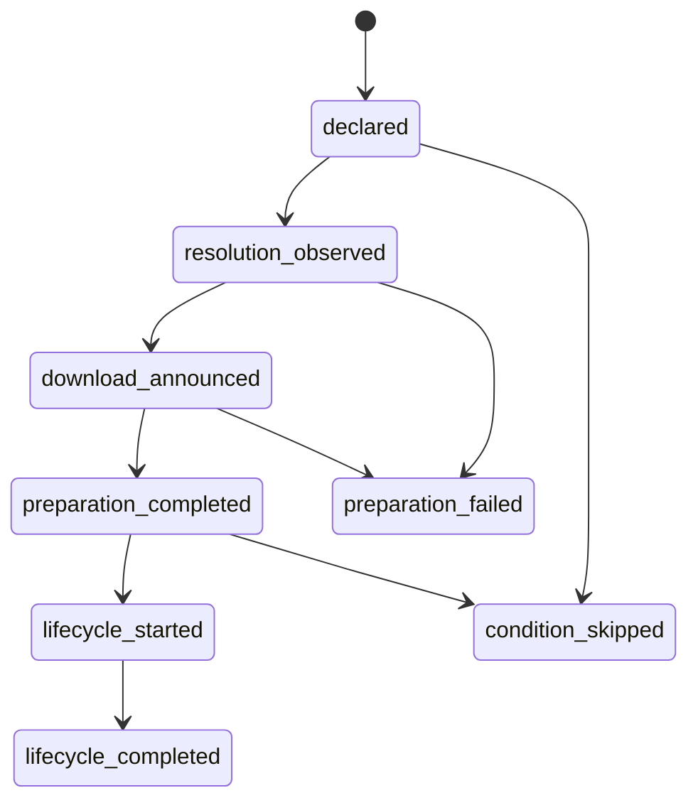

# CIRewind evidence model

Status: implementation contract for v0.1
Scope: GitHub.com only
Research cutoff and source retrieval date: 2026-08-20

## Purpose

CIRewind answers incident-response questions with evidence-backed propositions, not a blended risk score. A finding says what GitHub recorded, what CIRewind reconstructed, or what evidence is missing at a precise historical scope. It does not silently upgrade possibility into execution, access into use, or temporal order into causation.

This document is normative for the collector, resolver, case database, archive, replay engine, reports, and tests. The words **MUST**, **MUST NOT**, **SHOULD**, and **MAY** are requirements in the RFC 2119 sense.

### Epistemic labels used here

- **Fact** means a claim supported by a cited primary source as retrieved on 2026-08-20.
- **Inference rule** means a deterministic CIRewind conclusion from identified evidence. An inference is never presented as a GitHub fact.
- **Design decision** means a required product behavior.
- **Assumption pending spike** means a conservative implementation premise that requires controlled GitHub.com validation before it can become a supported evidence rule; otherwise it remains an explicit limitation or gap.
- **Unknown** means GitHub's retained data or current public documentation does not establish the proposition.

Source citations such as [S1] refer to the primary-source register at the end of this document. Source-code citations are pinned to commits; documentation citations record the retrieval date.

## Mandatory invariants

These sentences MUST appear verbatim in user-facing methodology material and in the test oracle. No derived rule, summary, visualization, severity label, or export may contradict them.

> Action downloaded != Action executed

> Repository possesses a secret != affected step could read that secret

> id-token: write != cloud role assumed

> Workflow ran during incident window != compromised SHA executed

> Current tag points to a safe commit != historical runs were safe

> No retained logs != no compromise

> Deployment followed an affected step != attacker caused the deployment

> Present-day workflow YAML != historical workflow definition

The graph is a projection of these propositions and their evidence. It is not an alternate place to relax them.

## Unit of analysis and historical identity

### Primary execution identity

The primary execution key is:

```text
repository_id + run_id + run_attempt + job_id
```

The externally required core is `run_id + run_attempt + job_id`; `repository_id` is prepended to prevent cross-repository ambiguity and survive repository renames. The repository owner/name observed at event time and at collection time are descriptive aliases, not identity.

**Fact.** `github.run_id` does not change when a workflow is re-run, while `github.run_attempt` starts at 1 and increments for each attempt [S8]. The REST API exposes an attempt-specific workflow-run resource and an attempt-specific job listing [S9][S10]. Therefore, CIRewind MUST NOT merge jobs or conclusions from materially different attempts.

Job display names and step display names are hostile, mutable labels. A matrix creates separate jobs, and each returned job ID is analyzed separately. Never key a matrix child by its rendered name.

### Required identifier fields

The normalized model MUST preserve the following as distinct nullable fields. A missing field remains null with a coverage reason; one identifier MUST NOT be copied into another merely to fill it.

| Concept | Required representation | Rule |
|---|---|---|
| Repository | numeric repository ID; owner/name snapshots | Numeric ID is identity; retain historical spelling when available. |
| Workflow path | repository-relative path | Preserve exact case and path returned or parsed; never use it as a filesystem path without canonicalization. |
| Workflow definition commit | Git object ID `{algorithm, full value}` for the bytes parsed | Hash the retrieved bytes and cite their evidence object. |
| Trigger SHA | event-dependent triggering or merge Git object ID | Preserve API `head_sha`/event fields under their source names plus repository hash algorithm when known. Do not treat it as the workflow commit. |
| Caller workflow SHA | Git object ID for the workflow definition that made a reusable-workflow call | One per call edge and call depth. |
| Called reusable-workflow SHA | exact Git object ID recorded or independently resolved for the called definition | Preserve declared ref separately. |
| Action source SHA | exact Git object ID returned during runner resolution | Preserve action repository, subpath, declared ref, and hash algorithm separately. |
| Immutable package digest | typed subject namespace plus algorithm and normalized full value | `github-action-package` is distinct from executable, OCI, release-asset, and workflow-artifact digests even when bytes/algorithm match. Do not substitute source Git object ID for a package digest or vice versa. |
| Run | numeric run ID | Stable across attempts, so insufficient alone. |
| Attempt | positive attempt number | Required even for attempt 1. |
| Job | numeric job ID | Required for an execution conclusion. |
| Step | API/timeline identifier if present; otherwise job-scoped step number plus lifecycle phase | A name is descriptive only. Preserve YAML pointer when reconstructable. |
| Event | event type and relevant event payload identifiers | Preserve `pull_request`, `pull_request_target`, `workflow_run`, and other types exactly. |
| Actor | original actor ID/login | Separate from triggering actor. |
| Triggering actor | actor ID/login that initiated this attempt | Never use to recalculate original privileges. |
| Event time | timestamp or bounded interval with source and precision | Used for incident-window evaluation. |
| Collection time | collection start/end timestamps | Used for chain of custody and freshness, never incident-window evaluation. |

**Fact.** GitHub documents `github.sha` as the SHA that triggered the workflow and `github.workflow_sha` as the commit SHA of the workflow file; newer GitHub.com job context also distinguishes the workflow file defining the current job [S8]. GitHub also exposes a repository hash-algorithm endpoint, so v0.1 stores every Git object ID as algorithm plus opaque full value rather than assuming 40-character SHA-1 [S36]. Event semantics vary: for example, a `pull_request` run normally uses the synthetic merge commit and merge ref, whereas `pull_request_target` uses the base/default-branch context [S11]. This is why API `head_sha` is not a universal “everything that ran” identifier.

### Step identity and lifecycle

A normalized step key is `(job_id, timeline_record_id)` when a stable timeline/check record identifier is available. Otherwise it is `(job_id, api_step_number, lifecycle_phase, occurrence)`. `lifecycle_phase` distinguishes an Action's pre, main, and post handlers. `occurrence` disambiguates repeated or malformed records and is assigned deterministically in source order.

Rendered names MUST be stored after terminal-control sanitization alongside a hash of the original bytes. They MUST NOT participate in identity, log boundary detection, SQL construction, report markup, or path construction.

## Finding contract

A finding is an incident-pack-specific proposition about one subject. It has exactly one semantic state. Multiple findings may share a subject when they express different propositions—for example, an exact execution proposition and a separate material-contradiction proposition. Reports MUST NOT collapse those findings into a numeric score.

Minimum finding fields are:

```yaml
finding_id: stable logical identifier
finding_revision_id: content-addressed revision identifier
incident:
  id: pack incident ID
  pack_version: reviewed pack version
  source_pack_sha256: hash of original validated YAML bytes
  canonical_pack_sha256: hash of schema-canonical pack JSON
indicator_id: stable indicator ID
subject:
  repository_id: integer
  run_id: integer|null
  run_attempt: integer|null
  job_id: integer|null
  step_key: string|null
state: one of the ten values below
provenance_level: L4_CERTAIN|L3_STRONG|L2_PROBABLE|L1_POSSIBLE|L0_UNKNOWN
proposition: bounded structured assertion, not free-form evidence
evidence_ids: [stable evidence IDs]
coverage_ids: [coverage assessment IDs]
derivation:
  rule_id: versioned rule name
  rule_version: semantic version
  first_produced_analysis_id: stable analysis-session ID
  first_produced_engine_version: CIRewind build that first materialized this revision
  canonical_inputs_sha256: hash
event_time:
  start: timestamp|null
  end: timestamp|null
  bounds: "[)"|"[]"|"()"|"(]"|null
  source_precision: second|minute|hour|day|unknown
  approximation: exact|source-rounded|conservative-expanded|unknown
  basis: string
collection_time: timestamp
supersedes_revision_id: string|null
```

`finding_id` is the SHA-256 of canonical `(incident ID, incident-pack API/schema major, indicator ID, subject key, proposition kind)`. “API/schema major” means the major version encoded by `apiVersion` (for example, `v1` in `cirewind.dev/v1alpha1`); the major component of `metadata.packVersion` is not part of this logical ID. `finding_revision_id` additionally covers the exact canonical pack hash, state, provenance, evidence IDs, coverage IDs, rule version, and canonical proposition. A recollection appends a finding revision only when one of those identity-bearing inputs changes; a byte-identical recollection reuses the existing evidence and finding revision while appending its collection observation. A reviewed pack update likewise appends a revision only when its canonical hash/input changes. Nothing rewrites the evidence ledger.

Display prose, engine build version, and analysis time are audit data but excluded from revision identity. `first_produced_*` and the revision's `collection_time` describe the immutable creation of that revision; they are never updated when another analysis reuses it. Every analysis session records its own engine version/time and links the exact revisions it selected or emitted through an append-only analysis-session-to-finding-revision relation. Thus a build-only replay is auditable without inventing a duplicate revision ID.

## The ten semantic finding states

These are the complete finding-state vocabulary. Implementations MUST use the spellings exactly and MUST reject any other value in v0.1.

| State | Normative meaning | Minimum support |
|---|---|---|
| `CONFIRMED_EXECUTED` | The exact affected Action SHA or immutable package digest was resolved and the corresponding step demonstrably began execution. | Exact runtime resolution joined to a structurally identified pre, main, or post Action lifecycle start in the same job and attempt. |
| `CONFIRMED_DOWNLOADED` | The affected Action was downloaded or prepared by the runner, but step execution could not be demonstrated. | Exact runtime resolution plus evidence that preparation completed; no lifecycle-start evidence for that occurrence. |
| `CONFIRMED_CALLED_WORKFLOW` | GitHub recorded the exact affected reusable-workflow SHA for the run attempt. | Attempt-specific GitHub metadata recording path and exact called SHA. It does not say that every called job started. |
| `DECLARED_AT_RUN_SHA` | The historical workflow definition at the relevant workflow commit contained the affected immutable reference. | Bytes retrieved at a proven historical workflow-definition SHA, parsed without execution, containing the exact full SHA or immutable digest. |
| `RUN_IN_WINDOW_MUTABLE_REF` | The historical workflow used an affected mutable reference during the incident window, but exact runtime resolution evidence is unavailable. | Historical definition, exact declared mutable ref, relevant event time in the component-specific window, and a recorded runtime-evidence gap. |
| `POTENTIAL_TRANSITIVE` | The affected Action is reachable through a wrapper, composite Action, reusable workflow, or embedded dependency, but exact runtime resolution is unavailable. | A parser-derived path through historical definitions or exact Action metadata; every edge cites evidence and the unresolved boundary is explicit. |
| `CURRENT_REFERENCE_ONLY` | Only the present-day repository configuration references the affected component. | Current configuration evidence with no supported link to a historical run attempt. |
| `NO_MATCH_CONFIRMED` | All relevant retained evidence was examined and no incident match was found. | Incident-specific coverage proof for a bounded repository/time/attempt set and parser versions; it never means generally uncompromised. |
| `UNKNOWN_EVIDENCE_GAP` | Logs, workflow definitions, permissions, attempts, or other required evidence are deleted, expired, inaccessible, or incomplete. | Positive evidence of a missing required evidence class or an unresolved access/parse failure. |
| `CONTRADICTORY_EVIDENCE` | Static configuration, API metadata, and runtime evidence materially disagree. | At least two cited propositions that cannot both be true for the same identity and interpretation. Preserve both; do not silently pick one. |

### State application rules

1. State is not severity. The order above is not a risk ranking.
2. Exact runtime evidence wins only for the proposition it directly supports. It does not erase a separate contradiction or gap.
3. A mutable declaration and its exact resolved SHA are expected layers, not a contradiction.
4. A finding about a reusable workflow uses `CONFIRMED_CALLED_WORKFLOW`; jobs and Actions reached inside it receive separate findings.
5. `CONFIRMED_DOWNLOADED` requires completion evidence. A runner's “Download …” announcement alone is an exact-resolution/download-attempt observation, because current runner source emits it before downloading and extracting the archive [S3]. If setup then fails without a per-Action completion boundary, do not claim completed download.
6. When exact same-attempt runtime resolution and the occurrence join are satisfied, any proven Action pre, main, or post lifecycle start can support `CONFIRMED_EXECUTED`. A skipped main step does not negate an independently observed pre handler.
7. A current safe tag, a current safe workflow, or a known-good SHA does not downgrade historical runtime evidence.
8. If evidence required to choose between a positive state and a negative is absent, emit `UNKNOWN_EVIDENCE_GAP`; never default to `NO_MATCH_CONFIRMED`.
9. `NO_MATCH_CONFIRMED` is scoped. Its proposition MUST name repositories, explicitly bounded UTC interval (including precision/approximation), attempts, indicator set, evidence classes, and parser versions examined.
10. A case-wide rollup MAY group findings, but MUST retain each underlying state, subject, provenance level, evidence set, and gap. The rollup cannot output a stronger semantic state than its strongest directly supported child proposition.

### Deterministic derivation matrix

| Proposition | Required evidence | Result | Disqualifiers or companion findings |
|---|---|---|---|
| Exact affected Action SHA/digest and lifecycle began | Same-attempt preparation resolution; step/lifecycle frame; unambiguous ref-to-step join | `CONFIRMED_EXECUTED` | Ambiguous structural join produces a gap, not execution. A fixed-ref mismatch also produces a separate contradiction. |
| Exact affected Action SHA/digest prepared; lifecycle absent | Exact resolution; setup/preparation completion or stronger subsequent proof | `CONFIRMED_DOWNLOADED` | Setup failed after announcement with no completion proof produces a gap. |
| Exact affected called workflow SHA in attempt metadata | Attempt resource; path; SHA; indicator match | `CONFIRMED_CALLED_WORKFLOW` | Missing attempt metadata produces a gap; do not substitute current ref resolution. |
| Exact immutable reference in historical YAML | Workflow bytes at proven definition SHA; source hash; parsed node/span | `DECLARED_AT_RUN_SHA` | Present-day bytes or an unproven workflow commit are insufficient. |
| Mutable affected ref in historical YAML and event in window | Proven historical YAML; ref; event time; incident component window; runtime gap | `RUN_IN_WINDOW_MUTABLE_REF` | Exact runtime safe SHA refutes this proposition for that occurrence; retain any unrelated gap separately. |
| Transitive parser path only | Historical wrapper/metadata chain with cited edges | `POTENTIAL_TRANSITIVE` | If any necessary file or dynamic indirection is unavailable, path ends at an explicit unknown boundary. |
| Current-only reference | Current workflow/metadata snapshot | `CURRENT_REFERENCE_ONLY` | Any historical run linkage requires a historical state instead. |
| Complete negative search | Closed candidate-run enumeration; every attempt; required evidence classes; parser success | `NO_MATCH_CONFIRMED` | Any material missing attempt/source/parser coverage produces a gap instead. |
| Required source unavailable or incomplete | Error/retention/permission/truncation evidence | `UNKNOWN_EVIDENCE_GAP` | An HTTP 404 alone must be classified cautiously; it may represent missing, inaccessible, or nonexistent data. |
| Fixed immutable declaration and runtime resolution disagree | Both exact propositions mapped to same occurrence | `CONTRADICTORY_EVIDENCE` | A mutable ref resolving to a SHA is normal and is not contradictory. |

## Provenance ladder

Provenance measures support for the finding's proposition, not danger, impact, or remediation priority. Reports emphasize semantic state; numeric equivalents are only for filtering.

| Level | Label | Meaning | Typical examples |
|---|---|---|---|
| `L4_CERTAIN` | Certain | Direct, exact, internally consistent evidence from the relevant attempt or content-addressed object. | Exact runner resolution plus structural lifecycle-start frame; attempt API records exact reusable-workflow SHA; a logged immutable package digest. |
| `L3_STRONG` | Strong | Deterministic reconstruction from exact historical bytes or multiple consistent primary observations, with a bounded unobserved step. | Full-SHA declaration in workflow bytes fetched at a proven workflow commit; complete scoped negative search. |
| `L2_PROBABLE` | Probable | Time-bounded inference from historical configuration and incident data, but exact runtime resolution is absent. | A historical mutable ref ran inside its component exposure window. |
| `L1_POSSIBLE` | Possible | Reachability or present-state evidence with no exact historical runtime binding. | A static transitive path; current reference only. |
| `L0_UNKNOWN` | Unknown | The target proposition is unsupported because required evidence is missing, inaccessible, ambiguous, or mutually irreconcilable. | Expired attempt logs; unresolvable historical workflow commit; ambiguous step join. |

The default mapping is not absolute: provenance attaches to a proposition. For example, an API 404 can be `L4_CERTAIN` evidence that a request returned 404 while leaving the proposition “the Action did not execute” at `L0_UNKNOWN`. A material contradiction can itself be certain even though the disputed execution proposition remains unknown.

Provenance MUST NOT be averaged. A derived proposition's level cannot exceed the weakest indispensable edge unless a versioned rule explicitly supplies independent corroboration. All such corroboration is listed by evidence ID.

## Runtime reconstruction and downloaded-versus-executed semantics

### Source-backed runner behavior

**Fact.** Current open-source runner code calls `PrepareActionsAsync` during the runner-owned “Set up job” phase and passes all job Action steps before constructing their normal execution runners [S1]. `PrepareActionsAsync` recursively resolves required repository Actions [S2]. The runner emits either an exact resolved source SHA or, for an immutable package, its version, manifest digest, and source commit SHA [S3]. GitHub's maintained audit utility parses these exact setup-log forms, which validates the format as useful evidence but does not change CIRewind's stricter completion and attempt rules [S6].

**Fact.** Current runner code evaluates a step condition before calling the step. If false, it records the step as skipped; if true, it starts the step and invokes it [S4]. The Action handler prints the runner-owned `Run owner/repository[/path]@ref` group after condition evaluation and before invoking the handler [S5]. These boundaries support a distinction between preparation and lifecycle start.

**Fact.** The download announcement is emitted before archive download and extraction [S3]. Therefore its text alone proves exact resolution and that the download routine was entered, not that all bytes were successfully prepared.

**Fact.** A JavaScript or Docker Action may declare a pre handler; GitHub documents that it runs at job start and defaults its own `pre-if` to `always()` [S12]. **Assumption pending spike:** the exact interaction between a false top-level step condition and a declared pre handler is not qualified across runner generations in v0.1. CIRewind therefore models pre, main, and post separately and trusts observed lifecycle frames rather than assuming that “main skipped” means “no code from the Action ran.”

**Fact.** Local composite Actions are prepared just in time when their main Action runner begins in current runner source, rather than necessarily during initial remote-Action preparation [S7]. This affects scenario D: a skipped remote composite can have transitive downloads prepared at setup, while a skipped local composite may never have its metadata loaded by the runner.

### Observation state machine

The following lower-case labels are internal observations, not additional finding states:



The implementation stores observations rather than destructively transitioning one row. Relevant rules are:

- `declared`: exact historical YAML or composite metadata names an Action/ref. It is static.
- `resolution_observed`: runner-owned setup data binds an Action/ref to a source SHA or immutable digest.
- `download_announced`: the runner entered the per-Action download routine. This is not completion by itself.
- `preparation_completed`: inferred when the setup record completed successfully after awaited Action preparation, or established by a stronger later lifecycle observation. The inference cites the setup step and runner-source rule version.
- `condition_skipped`: an API/timeline step record or structural log boundary identifies that lifecycle as skipped.
- `lifecycle_started`: a runner-owned Action-details frame is structurally associated with the step after condition evaluation, corroborated by the API step record where available.
- `lifecycle_completed`: the corresponding structural step end/conclusion exists. Completion is not required for `CONFIRMED_EXECUTED` and does not prove the Action's intended payload succeeded.
- `preparation_failed`: setup failed or logs ended before completion. It blocks `CONFIRMED_DOWNLOADED` unless independent completion evidence exists.

### Structural log parsing requirements

Run logs and every string within them are hostile. A literal search for `Download action repository` or `##[group]Run` anywhere in arbitrary output is insufficient because workflow code can print lookalike text.

The parser MUST:

1. bind an archive to repository, run ID, attempt, job ID, response hash, and collection request before parsing;
2. use attempt-specific log archives; partial rerun archives contain only rerun jobs, and GitHub instructs investigators to retrieve previous attempts for the other jobs [S13];
3. establish runner-owned setup and step record boundaries before accepting markers;
4. correlate job API step number/status/time with the bounded log record when available;
5. require expected marker position and grammar for the recorded runner version; preserve unmatched variants as evidence gaps;
6. strip terminal controls only for display, retaining the raw-object hash and bounded parser offsets;
7. treat duplicate, reordered, truncated, forged-looking, or ambiguous records as contradictions or gaps rather than choosing the convenient line;
8. record parser/extractor version and the rule-pattern bundle hash;
9. map one setup resolution to all same-ref declarations only within the same job attempt and only under the runner's cache semantics; and
10. never execute, import, build, or check out fetched Action code to resolve ambiguity.

**Fact.** GitHub.com now permits `run` and `uses` steps to execute in the background and supports explicit wait/cancel/parallel constructs [S35]. Step number or YAML order is therefore not a general happens-before relation. The parser stores each step's own start/end interval and explicit synchronization edges. Cross-step “before,” secret-flow, file-flow, and downstream-resource conclusions require non-overlapping timestamps or a proven wait/dependency edge; interleaved or concurrent records remain unordered.

GitHub's `audit-actions-workflow-runs` utility is a useful format oracle: its pinned parser recognizes the mutable Action SHA line and immutable package group, including version, source SHA, and SHA-256 digest [S6]. Its pinned collector reads a run-level logs URL rather than implementing CIRewind's every-attempt model [S14]. CIRewind SHOULD reuse the validated grammars as attributed test fixtures, not copy the utility's evidence scope or ZIP handling assumptions.

### Exact join rules

An exact SHA/digest resolution is normally Action-ref-scoped during setup; execution evidence is step-scoped. The join key is `(repository_id, run_id, attempt, job_id, normalized action repository, action subpath, declared ref)`, plus lifecycle and structural occurrence where duplicates exist.

- A full SHA in a `Run` group is still joined to setup resolution; the display line does not replace the recorded source SHA/digest.
- A mutable ref may resolve differently in different attempts. Never carry a resolution forward.
- A composite wrapper's lifecycle start does not prove that every embedded step started. Embedded Action findings require their own structural lifecycle evidence.
- A setup resolution for an embedded Action can support download without execution when the parent or child condition skips it.
- Docker and JavaScript Action handler start is sufficient for “step began execution,” but not for completion, exfiltration, or successful payload behavior.
- Local `uses: ./path` has no repository Action download record. Its runtime bytes may come from a checkout ref and may have been modified by earlier steps. Unless retained evidence proves the bytes, reconstructing the path from a repository commit is static and cannot alone support exact execution of those bytes.
- An Action or wrapper that downloads tools internally is outside runner Action-resolution logs. It is transitive unless a pack's immutable package digest or other bounded runtime indicator is directly observed.

### Reruns and called workflows

**Fact.** GitHub states that reruns use the privileges of the actor who originally triggered the run, while preserving the original `GITHUB_SHA` and `GITHUB_REF`; the actor initiating the rerun can differ [S15][S8]. Store both actors and do not infer attempt privilege from `triggering_actor`.

**Fact.** For a reusable workflow referenced by a mutable ref, a full rerun uses the workflow at the specified ref, while a failed-job or single-job rerun uses the reusable workflow at the same commit SHA as the first attempt [S16]. The attempt API response includes `referenced_workflows` entries with path, declared ref where applicable, and exact SHA [S9]. This is the preferred basis for `CONFIRMED_CALLED_WORKFLOW`.

**Design decision.** Each attempt receives an independent called-workflow map. A failed-job or single-job rerun contains only jobs actually executed in that attempt; findings from jobs absent in that attempt stay attached to the earlier attempt. An overall run view links attempts but does not synthesize a fictitious combined attempt.

**Controlled observation.** The bounded [tag-move lab](validation/2026-08-22-controlled-lab-qualification.md) retained separate per-attempt resolution/download records for full, failed-job, and single-job reruns; it did not carry an Action object across attempts. This observation is grammar- and fixture-scoped. Only the applicable attempt's retained runtime evidence establishes its SHA/digest.

**Unknown outside the qualified matrix.** Public REST documentation and the bounded lab establish exact called-workflow objects for the observed attempts, including partial reruns. They do not establish that every nested level is returned, every same-repository form is represented identically, or every deleted/private called repository fails alike. Those cases remain explicit gaps until separately qualified.

## Historical definitions and transitive reconstruction

The resolver is a parser, not an executor. It retrieves workflow YAML, `action.yml`, or `action.yaml` through GitHub's content APIs at an exact commit SHA and hashes the returned bytes. The content API accepts a `ref`; exact commit SHAs are therefore the required ref for historical objects [S17].

For every definition, store:

- repository numeric ID and historical owner/name;
- path and exact definition commit as Git object hash algorithm plus full value;
- fetched-byte SHA-256, media type, size, and evidence ID;
- declared Action or reusable-workflow repository, subpath, and ref;
- source span or canonical YAML node path;
- call/dependency depth and parent edge;
- parser version and limits applied;
- whether expressions or dynamic workspace behavior prevent resolution.

Historical retrieval MUST follow exact runtime/API SHAs when present. If the caller workflow commit is not provable, do not substitute the trigger SHA. `github.workflow_sha` and the event-specific source rules may inform resolution, but only a cited observation can populate `workflow_definition_commit` [S8][S11]. Present-day default-branch YAML is stored only as current evidence and can support only `CURRENT_REFERENCE_ONLY` unless separately linked.

Composite metadata is parsed as hostile data. Repository Actions nested in a composite are resolved recursively at their exact downloaded source commit when available. Local paths are normalized within the repository/workspace model; path escape, symlink, missing content, dynamic generation, or prior-step mutation ends the static chain with an explicit gap. No fetched code is imported, run, built, checked out, or evaluated beyond bounded YAML parsing.

Current GitHub.com syntax distinguishes two same-repository forms. **Fact.** `$/path` binds to the repository containing the currently running workflow or Action at that definition's running commit, requires no checkout, forbids an `@ref` suffix, and is unavailable on GHES; `./path` binds to the checked-out runner workspace [S34]. For historical `$/path`, CIRewind records the containing definition repository/SHA as the Action source candidate and requires evidence that the run used a supporting GitHub.com runner before treating a lifecycle marker as exact execution of that commit. For `./path`, arbitrary checkout inputs and prior workspace mutation retain the local-byte uncertainty described above. The two forms MUST never be normalized into one another.

## Evidence-object contract

### Content identity and append-only observations

An evidence object is a content-addressed snapshot of a logical source. One or more append-only collection observations record when and how that exact snapshot was obtained.

```text
logical_source_id = "src1:" + sha256(canonical logical-source identity)
evidence_id = "ev1:" + sha256(logical_source_id + source-content-sha256 + canonical retention/redaction descriptor)
observation_id = "obs1:" + sha256(evidence_id + collection-session-id + request-id + collection-ended-at + request-attempt)
```

The logical-source identity contains source kind, canonical API/artifact identifier, repository ID, run ID, attempt, job ID when applicable, and a redacted canonical request selector. It excludes ephemeral redirect query strings, authentication, collection time, and local output paths. Identical bytes collected again under the same retention/redaction descriptor reuse `evidence_id`; changed bytes or a materially different retained representation receive a new evidence ID and retain the same `logical_source_id`. This lets a finding cite the exact content it used while collection observations remain bitemporal and idempotent.

The retention/redaction descriptor includes source media type and byte length, raw-retained flag, retained-payload hash or explicit absence, redaction status, and redaction-policy version. For a derived evidence object, identity covers derivation kind, ordered parent evidence IDs, rule ID/version, canonical parameter hash, and derived payload hash. Circular derivations are invalid.

“Canonical” means UTF-8 JSON Canonicalization Scheme (RFC 8785) bytes. Timestamps used in identity are normalized to UTC RFC 3339 with the shortest representation that preserves collected precision; integers are decimal; hashes are lowercase hexadecimal. Arrays that represent sets, including evidence IDs and coverage IDs, are deduplicated and bytewise sorted before canonicalization. Source-ordered arrays such as log observations retain source order. Floating-point values and Unicode normalization transformations are forbidden in identity inputs. These rules are schema-versioned; a future change requires a new ID prefix rather than silently changing an existing ID.

### Minimum envelope

Every material evidence object MUST provide the following fields, either directly or through its linked append-only observation:

```yaml
schema_version: cirewind.evidence/v1alpha1
evidence_id: ev1:<hex>
observation_id: obs1:<hex>
collection_session_id: stable non-secret session ID
request_id: stable collection request ID
logical_source:
  id: src1:<hex>
  kind: workflow_run_attempt_log|job_log|api_json|repository_content|derived_record|other_bounded_kind
  canonical_id: non-secret stable API or artifact identifier
source:
  provider: github.com|cirewind
  api_version: string|null
  endpoint_template: string|null
  source_url: string|null
  request_parameters: {}        # allowlisted and redacted
  request_attempt: integer
  http_status: integer|null
scope:
  repository_id: integer|null
  repository: owner/name|null
  workflow_path: string|null
  run_id: integer|null
  run_attempt: integer|null
  job_id: integer|null
  step_key: string|null
time:
  event_time: timestamp|null
  event_time_end: timestamp|null
  event_time_bounds: "[)"|"[]"|"()"|"(]"|null
  event_time_source_precision: second|minute|hour|day|unknown
  event_time_approximation: exact|source-rounded|conservative-expanded|unknown
  event_time_basis: api_field|log_timestamp|definition_commit|unknown
  collection_started_at: timestamp
  collection_ended_at: timestamp
content:
  media_type: string
  byte_length: integer             # bytes actually received and hashed
  declared_byte_length: integer|null
  complete: boolean
  source_sha256: lowercase hex
  retained_payload_sha256: lowercase hex|null
  raw_retained: boolean
  retained_path: relative/path|null
extractor:
  name: string
  version: string
  ruleset_sha256: lowercase hex
redaction:
  status: not_applicable|not_inspected|structured_allowlist|redacted
  policy_version: string
derivation:
  kind: string|null
  parent_evidence_ids: []
  parameters_sha256: lowercase hex|null
supported_finding_revision_ids: []
errors:
  - phase: collect|decode|extract|derive
    code: stable_machine_code
    http_status: integer|null
    retryable: boolean
    permission_related: boolean|null
    sanitized_message: bounded escaped string|null
    raw_message_sha256: lowercase hex|null
```

Additional requirements:

- `source_sha256` is computed while streaming the original response before optional discard or redaction. It proves integrity from collection onward, not that GitHub's source was truthful.
- If raw bytes are not retained, `retained_payload_sha256` covers the compact structured record that is retained. The manifest covers all retained files.
- A hash of discarded raw bytes is not replayable content. Default archive replay can re-match newly published structured indicators against retained normalized Action SHAs, package digests, workflow identities, permissions, and other ledger fields. A later pack that requires a previously unretained literal log substring or a new extractor over raw bytes produces a typed replay coverage gap; the hash alone MUST NOT be presented as if those bytes were searchable.
- `source_url` excludes signed redirect query strings. `request_parameters` is an endpoint-specific allowlist. Authentication headers, tokens, cookies, JWTs, secret values, and signed download credentials are never stored.
- Byte length is the number of response bytes actually received and hashed. A `Content-Length`, when trustworthy enough to record, is separate. If a configured limit or transport failure interrupted collection, `complete` is false and a truncation error is mandatory; `source_sha256` then covers only the retained/observed prefix and cannot support a complete negative search.
- Redaction status never claims logs are safe merely because GitHub masking was present. Default compact extraction stores only allowlisted structured fields and bounded sanitized snippets needed to support a finding.
- Every error is evidence. Raw hostile API error text is hashed and, if retained at all, bounded and escaped. It is never used as terminal control, HTML, SQL, or a path.
- `supported_finding_revision_ids` is materialized in the relational `finding_revision_evidence` index or emitted as a later ledger relation; append-only evidence-object JSONL records are not rewritten. The logical finding ID is reachable through the revision.
- A material graph edge has its own derived evidence record or relation row citing one or more evidence IDs and the derivation rule.

The JSON Schema contracts deliberately separate payload semantics from ledger
framing. `schema/evidence-v1alpha1.json` validates one evidence object plus its
collection observation. `schema/evidence-ledger-v1alpha1.json` validates each
complete `evidence.jsonl` line, including its sequence field and the
record-type-specific evidence or finding payload. Cross-record monotonicity is
enforced by the single ledger writer and its tests. The generated-case schema
test registers every referenced schema locally and disables fallback loading;
the schemas use relative identifiers and sibling references, so validation in
the default test suite performs no network access and makes no claim over an
external schema-hosting domain.

### Evidence classes and source authority

Evidence classes are orthogonal; none is globally authoritative for every proposition.

| Evidence class | Strongest supported proposition | Cannot establish by itself |
|---|---|---|
| Attempt-specific setup log | Exact runtime Action SHA/digest resolution; token-permission print; preparation sequence | Successful archive extraction when the log ends immediately after announcement; step execution |
| Structurally bounded step log | Lifecycle start/completion; literal runtime indicator | Exact source SHA unless joined to setup; truth of attacker-controlled output |
| Attempt workflow metadata | Exact called-workflow SHA; actors; event/run fields | Every called job started; Action SHA |
| Attempt-specific job API | Job identity, steps, conclusions, runner metadata returned by API | Exact Action SHA; secret values; causation |
| Exact historical repository content | What those exact bytes declared | That those bytes executed when runtime binding is absent |
| Current repository/settings/secret metadata | State at collection time | State at event time without a historical snapshot |
| Incident pack | What indicators and windows reviewers asserted | That a target matched; packs are hypotheses until joined to case evidence |
| Derived evidence | A deterministic, reproducible inference | A proposition stronger than its indispensable parents |

## Bitemporal and versioned reasoning

Every observation carries two time axes:

- **Event time** is when the GitHub activity, definition validity, resource creation, or runner log record occurred.
- **Collection time** is when CIRewind requested, received, hashed, and stored the observation.

Incident exposure windows are evaluated only against event time. Current settings, tags, environments, runners, secret metadata, and repository YAML are collection-time snapshots unless a source explicitly supplies historical validity.

An event timestamp can be an interval. For a log record it may be a precise line timestamp; for a definition it may be bounded by the commit and run scheduling data. Precision and basis are stored. If a component exposure window intersects an imprecise event interval but containment is not known, the result cannot be stronger than the rule for partial temporal overlap.

For a mutable Action ref, the relevant instant is runner resolution/preparation, not merely workflow creation. When its exact setup timestamp is unavailable, use the narrowest supported interval in this order: job `started_at`/setup interval, attempt `run_started_at` through job start, then run creation through job completion. `RUN_IN_WINDOW_MUTABLE_REF` requires evidence that the relevant job began; a workflow containing a ref in a job that never started is only a declaration/reachability fact. Full containment in the incident component window supports the normal temporal inference. Partial overlap is reported as an explicit temporal ambiguity at no more than `L1_POSSIBLE`, with a gap finding when the distinction is material.

Collection time enables statements such as “the log was retained and hashed on 2026-08-20” without implying it existed unchanged before collection. Recollection of identical bytes adds a collection observation to the same evidence object. Recollection of a changed still-running log or mutable API resource creates a new evidence object linked by the same logical source ID. Derivations cite the exact evidence ID and, when collection circumstances matter, observation ID used.

## Credential and resource exposure semantics

Credential analysis produces structured capabilities and flow edges attached to jobs, steps, and lifecycle phases. It does not alter the ten finding states and never retrieves secret values.

### `GITHUB_TOKEN`

**Fact.** Current runner source prints a runner-owned `GITHUB_TOKEN Permissions` group from the job message during setup [S1]. **Fact.** GitHub documents that an Action can access `github.token` even when the workflow did not explicitly pass the token [S18]. Therefore, the setup-log permission list is the preferred effective-permission evidence for that job attempt.

Rules:

1. Store one effective permission map per execution key. Each scope has the exact printed value and evidence ID.
2. If an affected Action lifecycle started, report the printed permissions as potentially reachable by that Action. Do not require an explicit `${{ secrets.GITHUB_TOKEN }}` mapping.
3. If the Action was only downloaded/prepared, do not say it could read the token; no affected Action handler was shown to start.
4. If the permission group is absent, statically reconstruct only when the historical enterprise/organization/repository default, historical caller/called workflow YAML, job override, event/fork policy, and reusable-workflow restriction are known. Mark the result inferred.
5. **Fact.** GitHub calculates permissions from defaults, workflow permissions, job permissions, and finally fork/Dependabot adjustments; nested reusable workflows cannot elevate permissions [S19][S16]. Missing historical settings make static results incomplete.
6. A token permission is a GitHub API capability, not proof that an API request or repository write occurred.

### Named secrets

The model distinguishes these propositions and never compresses them into “secret exposed”:

| Proposition | Required support | Temporal caveat |
|---|---|---|
| Secret name exists | Secret metadata API or archived settings snapshot | Current metadata proves existence at collection, not necessarily at event time. |
| Repository is policy-eligible | Organization visibility/selected-repository metadata or repository scope | A current policy is not a historical policy. |
| Historical definition references name | Exact workflow bytes and parsed expression/source span | An undefined secret expression may evaluate to an empty string. |
| Job receives reference | Reference occurs in job-level env/input or reaches the called workflow/job through a proven map | Job must actually start; fork and event rules may withhold secrets. |
| Specific step is passed reference | Affected step input/env or inherited job-level environment has a proven flow | Reference is not proof of non-empty value or successful use. |
| Reusable workflow receives mapping | Exact caller mapping or `secrets: inherit` edge at that call hop | Availability is direct-hop and subject to caller eligibility. |
| Environment secret is eligible | Environment targeted, gates crossed, job started, name existed in a contemporaneous snapshot | Current environment metadata alone is insufficient. |

**Fact.** GitHub's secret-list APIs return metadata such as name and timestamps, not secret values [S20]. CIRewind MUST use read-only metadata endpoints only and MUST NOT request public keys for the purpose of uploading, inspect values, test credentials, hash values, or infer values from masking.

**Fact.** GitHub says organization and repository secrets are read when a run is queued, while environment secrets are read when the referencing job starts [S21]. It also documents that ordinary fork-triggered workflows do not receive named secrets by default, with `GITHUB_TOKEN` handled separately [S22]. Event type, fork status, approval/policy settings, and queue/start time are therefore indispensable flow inputs.

Step flow rules:

- A secret passed in the affected step's `with` or `env` is directly referenced by that step.
- Runner Action-detail groups may echo input and environment fields with masking. CIRewind records only the statically identified secret name/flow edge and a bounded “redacted slot observed” fact; it never retains, compares, decodes, or attempts to recover the rendered value.
- A secret in job-level `env` is potentially readable by every process in that job whose lifecycle began, including an affected Action. Workflow-level env is expanded into job context and is treated similarly when proven from exact historical bytes.
- A secret used only by another step is not automatically readable by the affected step. Cross-step files, outputs, caches, process state, or self-hosted persistence require separate evidence; v0.1 records an unresolved indirect-flow boundary.
- A composite Action has no implicit secrets context; a named secret must flow through explicit inputs/environment or another proven channel. Preserve each wrapper-to-embedded-step mapping rather than attributing all caller secrets [S23].
- Secret names are normalized case-insensitively for matching while preserving source spelling. Same-name precedence across organization, repository, and environment scopes is stored; if historical scope is unknown, do not select a value source [S21].

### Reusable-workflow secrets

**Fact.** Callers may map named secrets or use `secrets: inherit`; secrets pass only to the directly called workflow and must be passed again at each nested hop [S24]. `secrets: inherit` can expose the caller's eligible organization and repository secrets to the directly called workflow, but it does not prove that a particular called job or step references them.

For each call edge, store the caller definition SHA, called definition SHA, call site, mapping kind, source secret name, target secret name, and evidence IDs. For inheritance, store the eligible name set only if a contemporaneous metadata snapshot establishes it; otherwise store “inheritance declared; eligible set unknown.” Never materialize values.

**Fact.** Environment secrets cannot be passed as `on.workflow_call` secrets in the manner of caller mappings; when a called workflow job names an environment, that environment's secret can take precedence [S25]. Environment analysis therefore attaches to the job defined by the called workflow, not blindly to the caller's call job.

### Environment gates

**Fact.** A job targeting a protected environment does not start until all protection rules pass and cannot access environment secrets before then [S26]. Consequently:

- a waiting, rejected, skipped, or never-started environment job MUST NOT be reported as having accessed environment secrets;
- a successful gate plus job start establishes environment-secret eligibility/read timing under GitHub's model, not that every value was injected into the runner or that the affected step read a named secret;
- a lifecycle-started affected step receives an environment-secret reachability edge only for names proven to be referenced or otherwise placed in its job environment;
- approval, bypass, wait timer, branch/tag rule, and custom protection evidence are separate observations; and
- environment configuration collected later is not assumed to match event-time configuration.

The v0.2 derived graph uses `ENVIRONMENT_GATE_SATISFIED` for the conservative
join of a started exact job with a retained `approved`, `bypassed`, `crossed`,
or contemporaneous `not-required` state. This relationship is a prerequisite
for named `ENVIRONMENT_SECRET_ELIGIBLE`. Four closed state-specific derivation
rules preserve the retained outcome in edge identity and conservative wording;
the graph does not relabel bypass or absence of a required gate as human
approval. A `not-required` assertion with unknown event time cannot satisfy
this prerequisite. A `pending` or `rejected` observation is necessarily
unstarted in one fact. A later start is a separate event-timed observation,
never a mutation of the earlier pending/rejected fact.

### OIDC

CIRewind uses two distinct proposition kinds:

- `OIDC_MINTING_CAPABILITY`: the affected lifecycle ran in a job with effective `id-token: write`, so it could request a GitHub OIDC token.
- `CLOUD_IDENTITY_REACHABLE`: a compatible relying-party trust policy accepted the relevant issuer, audience, subject, and other claims for a specific cloud identity at event time.

**Fact.** GitHub states that `id-token: write` only permits requesting an OIDC JWT and does not itself grant write access to resources; a cloud provider must be configured to trust GitHub and apply matching conditions [S27][S28]. Therefore:

- setup permissions plus affected lifecycle start may support `OIDC_MINTING_CAPABILITY`;
- download alone does not make the capability reachable by the affected Action code;
- `CLOUD_IDENTITY_REACHABLE` requires a separate provider adapter and content-addressed trust-policy evidence;
- even `CLOUD_IDENTITY_REACHABLE` means an exchange was possible, not that a token was requested, exchanged, or a role was assumed; and
- v0.1 MUST NOT mint a token, query a cloud account, or collect a JWT to “verify” exposure.

### Runners

Record API `runner_id`, `runner_name`, `runner_group_id`, `runner_group_name`, labels, runner version, OS/architecture evidence, hosted classification, and gaps per job attempt. The job API documents these runner fields [S10]. Names and labels are hostile text.

**Fact.** GitHub-hosted jobs run on a fresh runner instance, subject to documented runner-class exceptions; self-hosted runners do not have to start from a clean instance for every job [S29][S30]. These platform facts do not establish the actual persistence or compromise of a particular runner.

Rules:

- Classify self-hosted only from authoritative API/log evidence such as the `self-hosted` label or runner-owned setup markers. Ambiguous larger-runner/group metadata remains unknown.
- For self-hosted jobs, report runner identifiers/groups and “persistence and local-network reachability not determined” unless separate evidence exists.
- A label expresses routing/metadata, not proof that its OS, architecture, network zone, or security property was truthful at event time; GitHub allows custom labels and does not validate manually assigned defaults [S31].
- Do not claim endpoint compromise, persistence, lateral movement, or access to neighboring services from runner classification alone.

### Downstream resources

Store resources as observations with their own IDs and event times. Relationships use one of three evidence strengths: direct API attribution to a run, direct structural log/API operation attribution to a step, or temporal correlation only.

- Artifacts returned for a run can be linked to that run; the API includes run attribution and artifact digest metadata [S32]. Job/step producer attribution still needs stronger evidence.
- Packages, releases, deployments, environment deployments, repository writes, and pull-request changes are linked to an affected job only when a primary source supplies an identity join. Otherwise report “observed after” with the interval and search scope.
- A later resource is not proof of attacker control. A resource created by the same job is not automatically malicious. A deployment after execution is not proof that the affected Action caused it.
- Stronger causal wording requires direct, independently trustworthy evidence of the operation and actor. Hostile Action output alone is not independently trustworthy.

## Contradictions

Contradictions are first-class and non-destructive. The engine creates a contradiction group containing both propositions, evidence IDs, subject identity, comparison rule, and fields in disagreement. It never edits source evidence to make it consistent.

Material examples include:

- historical YAML pins full SHA A, while same-occurrence runtime resolution records SHA B;
- an immutable package record's source SHA/digest conflicts with a reviewed incident indicator's asserted tuple;
- attempt metadata records reusable-workflow SHA A, but content was fetched or attributed as SHA B;
- the API says the same lifecycle was skipped while a structurally valid runner-owned lifecycle-start record exists; or
- two attempt/job resources claim incompatible identities for the same canonical key.

Non-contradictions include a mutable tag resolving to a SHA, a downloaded Action whose main step was skipped, present-day state differing from historical state, or a downstream deployment following execution.

If a contradiction does not invalidate a separate direct proposition, retain both findings. For example, exact runtime execution can remain `CONFIRMED_EXECUTED` while a separate `CONTRADICTORY_EVIDENCE` finding records why the fixed historical declaration disagreed. If the contradiction makes the step-to-resolution join ambiguous, execution remains unknown and the case contains both contradiction and gap findings.

## Evidence gaps and partial coverage

Coverage is an explicit case object, not a footnote. For each repository and time partition, it tracks at least:

- repository enumeration and access;
- candidate-run enumeration and result-ceiling partition closure;
- run metadata;
- every run attempt discovered;
- attempt-specific jobs, including partial reruns;
- attempt and/or job logs;
- setup-log grammar support and parse completeness;
- caller workflow definition commit and bytes;
- each referenced reusable workflow's exact SHA and bytes;
- each needed Action metadata file and transitive boundary;
- effective token permissions;
- secret metadata/policy scope;
- environment and gate data;
- runner classification; and
- requested downstream-resource enrichments.

Each coverage row stores status, expected count if known, observed count, source evidence IDs, error code, permission hypothesis, retries, and collection interval. “Not requested” is different from “requested and unavailable.” Optional enrichment gaps do not invalidate an exact execution finding, but they do limit exposure conclusions.

**Fact.** GitHub retains Actions logs and artifacts for 90 days by default; public repositories can be configured from 1–90 days and private/internal repositories up to the documented higher limit. Changes are not retroactive [S33]. Logs can also be explicitly deleted [S13]. Missing logs are therefore an expected forensic condition, not negative evidence.

Rules:

1. A 404, 403, redirect failure, timeout, truncation, malformed archive, unsupported grammar, missing job in a partial attempt, or inaccessible repository becomes a typed collection observation.
2. Do not label a 404 “expired” unless retention age or another source establishes that cause. Report alternatives such as deleted, expired, inaccessible, or nonexistent.
3. If a partial rerun archive omits jobs, retrieve and model preceding attempts; never call the latest archive complete [S13].
4. An exact positive finding can coexist with unrelated gaps. A gap does not erase what is known.
5. A negative finding requires closed coverage for every evidence class needed by that incident pack. If logs are gone and exact runtime resolution is required, the negative conclusion is prohibited.
6. Archive replay uses archived coverage as of its collection time. It does not imply GitHub still retains the sources.

## Correct and prohibited conclusions

| Evidence | Correct conclusion | Prohibited conclusion |
|---|---|---|
| Setup logs record affected SHA B; bounded step frame starts the same Action | “The affected Action commit B was resolved and its lifecycle began in job J, attempt 2.” | “The compromise succeeded,” “secrets were exfiltrated,” or “the step completed.” |
| Setup logs record B; setup completes; API says main step skipped; no pre/post start | “B was prepared, but execution was not demonstrated.” | “B executed because the runner downloaded it.” |
| Download announcement for B is the final line before setup failure | “B was resolved and a download was attempted; completion is unknown.” | `CONFIRMED_DOWNLOADED` without another completion observation. |
| Attempt API records affected reusable-workflow SHA | “GitHub recorded the affected reusable workflow for this attempt.” | “Every job or step in that workflow executed.” |
| Historical exact workflow bytes pin affected SHA | “The workflow declared the affected SHA at the proven definition commit.” | “The Action executed” without runtime evidence. |
| Historical YAML uses affected tag during the window; logs expired | “The run used the mutable ref in-window; exact runtime resolution is unavailable.” | “The compromised SHA executed.” |
| Repository secret metadata currently lists `DEPLOY_KEY` | “A secret of that name exists at collection time.” | “The affected step could read it” or “it existed during the incident.” |
| Exact YAML passes `DEPLOY_KEY` to another step only | “Another step referenced the secret.” | “The affected Action could read the secret.” |
| Affected lifecycle starts with printed token permission `contents: write` | “The Action could use a job token with `contents: write`.” | “The Action wrote to the repository.” |
| Affected lifecycle starts with `id-token: write` | “The Action had OIDC minting capability.” | “A cloud role was assumed.” |
| Environment approval remains pending and job never starts | “Environment secrets were not made available to that job under retained evidence.” | “The skipped Action accessed environment secrets.” |
| Self-hosted label and runner ID are recorded | “The affected job ran on the identified self-hosted runner.” | “The attacker persisted on it” or “the internal network was reached.” |
| Artifact API attributes artifact X to affected run | “Artifact X was associated with the affected run.” | “Artifact X is malicious” without content/producer evidence. |
| Deployment occurs after affected step | “The deployment was observed after the affected step.” | “The attacker caused the deployment.” |
| Current tag points to known-good A after historical logs record B | “Current resolution is A; the historical attempt resolved B.” | “Historical runs were safe because the tag is now safe.” |
| Present-day YAML removed the Action | “Current configuration no longer references it.” | “The historical workflow did not reference or execute it.” |
| Attempt logs are expired | “Runtime status is unknown due to missing logs.” | “No compromise occurred.” |
| Fixed SHA A in exact historical YAML; runtime maps same step to B | “Material contradiction between static and runtime evidence.” | Silently trusting A or B without retaining the disagreement. |

## Facts, inferences, assumptions, and unresolved unknowns

### Source-backed facts adopted by v0.1

- The runner prepares remote Actions during setup and logs exact source SHAs or immutable package version/digest/source SHA [S1][S2][S3].
- Step conditions are evaluated before normal lifecycle invocation, and runner Action-detail output occurs at lifecycle start [S4][S5].
- Attempt-specific run logs and job APIs exist, and partial rerun logs omit jobs not rerun [S9][S10][S13].
- Attempt metadata can record exact referenced reusable-workflow SHAs [S9].
- Reruns retain original actor privileges and event SHA/ref; reusable-workflow ref behavior differs between full and partial reruns [S15][S16].
- Effective token permissions are printed by current runner code; GitHub documents the static fallback ordering [S1][S19].
- Environment gates precede job start/secret access, and `id-token: write` only enables OIDC token requests [S26][S27].

### Product inference rules

- Successful setup after awaited preparation converts exact resolution/download announcements into completed preparation observations.
- A structural Action-details frame after condition evaluation is the “began execution” boundary.
- Exact historical bytes plus a proven definition commit establish declaration, not execution.
- Current metadata is collection-time evidence unless a primary source establishes historical validity.
- Temporal sequence supports “observed after,” not causation.

### Assumptions that the feasibility spike must test

- Setup-log grammars and structural boundaries are stable enough across retained GitHub-hosted and self-hosted runner versions to parse conservatively.
- A false main-step condition plus Action pre/post metadata behaves as modeled; lifecycle frames remain distinguishable.
- Mutable repository Actions are re-resolved per rerun attempt/job as expected.
- Attempt-specific referenced-workflow metadata preserves the documented full-versus-partial rerun identity.
- Matrix jobs, nested composites, local composites, and partial reruns can be joined without relying on hostile display names.
- Setup success is a reliable completion boundary for every Action resolution emitted in that setup record.

### Unresolved unknowns to expose, not hide

- Whether the attempt API returns every nested reusable-workflow level and how it behaves after source repository deletion or access loss.
- Whether older retained runner versions or new immutable-package formats require additional pinned grammars.
- Whether GitHub exposes a reliable caller workflow-definition SHA for every event without workflow-authored logging; event-specific fallback must not misuse `head_sha`.
- Exact runtime bytes of local Actions after arbitrary checkout inputs or prior workspace mutation.
- Tool or package downloads performed internally by arbitrary Action code when no immutable runtime record exists.
- Event-time secret visibility and environment configuration when no archive snapshot exists.
- Actual secret reads, OIDC requests/exchanges, cloud-role assumptions, exfiltration, runner persistence, and downstream causation without independent telemetry.

## Source register

All sources below were retrieved on **2026-08-20**. GitHub documentation is current documentation as of retrieval; pinned source links identify the exact code reviewed. Significant GitHub runtime claims above cite one or more of these primary sources.

| ID | Primary source | Used for |
|---|---|---|
| S1 | [actions/runner `JobExtension.cs`, pinned permission lines 139–162](https://github.com/actions/runner/blob/258d6c857db3519913f7deb6004b60172f8043ae/src/Runner.Worker/JobExtension.cs#L139-L162) and [setup preparation lines 291–300](https://github.com/actions/runner/blob/258d6c857db3519913f7deb6004b60172f8043ae/src/Runner.Worker/JobExtension.cs#L291-L300) | Effective token-permission log and Action preparation during setup. |
| S2 | [actions/runner `ActionManager.cs`, pinned lines 69–117](https://github.com/actions/runner/blob/258d6c857db3519913f7deb6004b60172f8043ae/src/Runner.Worker/ActionManager.cs#L69-L117) | Preparation inputs and recursive resolution. |
| S3 | [actions/runner `ActionManager.cs`, pinned lines 1183–1225](https://github.com/actions/runner/blob/258d6c857db3519913f7deb6004b60172f8043ae/src/Runner.Worker/ActionManager.cs#L1183-L1225) | Mutable Action SHA log, immutable package version/digest/source SHA, and line-before-download ordering. |
| S4 | [actions/runner `StepsRunner.cs`, pinned lines 200–256](https://github.com/actions/runner/blob/258d6c857db3519913f7deb6004b60172f8043ae/src/Runner.Worker/StepsRunner.cs#L200-L256) and [lifecycle invocation lines 290–321](https://github.com/actions/runner/blob/258d6c857db3519913f7deb6004b60172f8043ae/src/Runner.Worker/StepsRunner.cs#L290-L321) | Condition evaluation, skip boundary, and step start. |
| S5 | [actions/runner `Handler.cs`, pinned lines 102–166](https://github.com/actions/runner/blob/258d6c857db3519913f7deb6004b60172f8043ae/src/Runner.Worker/Handlers/Handler.cs#L102-L166) and [`ActionRunner.cs` invocation lines 272–278](https://github.com/actions/runner/blob/258d6c857db3519913f7deb6004b60172f8043ae/src/Runner.Worker/ActionRunner.cs#L272-L278) | Runner-owned Action detail group occurs before handler invocation. |
| S6 | [github/audit-actions-workflow-runs parser, pinned lines 62–132](https://github.com/github/audit-actions-workflow-runs/blob/1e536cc1af05a5e37a69d0c8dd479ec6ca2685bf/audit_workflow_runs_utils.js#L62-L132), [setup record selection, lines 135–173](https://github.com/github/audit-actions-workflow-runs/blob/1e536cc1af05a5e37a69d0c8dd479ec6ca2685bf/audit_workflow_runs_utils.js#L135-L173), and [pinned README support notice](https://github.com/github/audit-actions-workflow-runs/blob/1e536cc1af05a5e37a69d0c8dd479ec6ca2685bf/README.md#L1-L18) | GitHub-maintained exact Action/log grammar precedent. Repository README labels the tool unofficial. |
| S7 | [actions/runner `ActionRunner.cs`, pinned lines 82–99](https://github.com/actions/runner/blob/258d6c857db3519913f7deb6004b60172f8043ae/src/Runner.Worker/ActionRunner.cs#L82-L99) | Just-in-time preparation of local composite dependencies. |
| S8 | [GitHub Docs: Contexts reference](https://docs.github.com/en/actions/reference/workflows-and-actions/contexts) | Run ID/attempt, actors, trigger SHA, workflow SHA/ref, and job workflow identity. |
| S9 | [GitHub REST Docs: workflow runs—get an attempt and attempt logs](https://docs.github.com/en/rest/actions/workflow-runs) | Attempt resource, `referenced_workflows`, exact SHA/ref/path, and attempt log endpoint. |
| S10 | [GitHub REST Docs: workflow jobs](https://docs.github.com/en/rest/actions/workflow-jobs) | Attempt-specific job listing, step records, job IDs, log endpoint, runner fields. |
| S11 | [GitHub Docs: Events that trigger workflows](https://docs.github.com/en/actions/reference/workflows-and-actions/events-that-trigger-workflows) | Event-specific SHA/ref, including pull request and `pull_request_target`. |
| S12 | [GitHub Docs: Metadata syntax for Actions](https://docs.github.com/en/actions/reference/workflows-and-actions/metadata-syntax) | Action pre/main/post and default `pre-if` behavior. |
| S13 | [GitHub Docs: Using workflow run logs](https://docs.github.com/en/actions/how-tos/monitor-workflows/use-workflow-run-logs) | Partial-rerun archives contain only rerun jobs; log deletion. |
| S14 | [github/audit-actions-workflow-runs collector, pinned lines 42–85](https://github.com/github/audit-actions-workflow-runs/blob/1e536cc1af05a5e37a69d0c8dd479ec6ca2685bf/audit_workflow_runs.js#L42-L85) and [run-level call, lines 159–170](https://github.com/github/audit-actions-workflow-runs/blob/1e536cc1af05a5e37a69d0c8dd479ec6ca2685bf/audit_workflow_runs.js#L159-L170) | Existing run-level log collection scope and error behavior. |
| S15 | [GitHub Docs: Re-running workflows and jobs](https://docs.github.com/en/actions/how-tos/manage-workflow-runs/re-run-workflows-and-jobs) | Original actor privileges and original `GITHUB_SHA`/`GITHUB_REF` on rerun. |
| S16 | [GitHub Docs: Reusing workflow configurations](https://docs.github.com/en/actions/reference/workflows-and-actions/reusing-workflow-configurations) | Reusable workflow rerun behavior and non-escalating token permissions. |
| S17 | [GitHub REST Docs: Repository contents](https://docs.github.com/en/rest/repos/contents) | Content retrieval by `ref` and content endpoint constraints. |
| S18 | [GitHub Docs: Use `GITHUB_TOKEN` for authentication](https://docs.github.com/en/actions/tutorials/authenticate-with-github_token) | Actions can access `github.token` without explicit input. |
| S19 | [GitHub Docs: Workflow syntax—how permissions are calculated](https://docs.github.com/en/actions/reference/workflows-and-actions/workflow-syntax#how-permissions-are-calculated-for-a-workflow-job) | Token default/workflow/job/fork calculation. |
| S20 | [GitHub REST Docs: Actions secrets](https://docs.github.com/en/rest/actions/secrets) | Secret metadata response and scope. |
| S21 | [GitHub Docs: Secrets reference](https://docs.github.com/en/actions/reference/security/secrets) | Secret timing, naming, limits, and precedence. |
| S22 | [GitHub Docs: Using secrets in Actions](https://docs.github.com/en/actions/how-tos/write-workflows/choose-what-workflows-do/use-secrets) | Fork/Dependabot restrictions and explicit use. |
| S23 | [GitHub Docs: Contexts—`secrets` context](https://docs.github.com/en/actions/reference/workflows-and-actions/contexts#secrets-context) | Composite Actions lack implicit secrets context. |
| S24 | [GitHub Docs: Reuse workflows—passing secrets](https://docs.github.com/en/actions/how-tos/reuse-automations/reuse-workflows#passing-inputs-and-secrets-to-a-reusable-workflow) | Named mapping, inheritance, and direct-hop transitivity. |
| S25 | [GitHub Docs: Reuse workflows—environment secret warning](https://docs.github.com/en/actions/how-tos/reuse-automations/reuse-workflows#using-inputs-and-secrets-in-a-reusable-workflow) | Called workflow environment-secret behavior. |
| S26 | [GitHub Docs: Deployments and environments](https://docs.github.com/en/actions/reference/workflows-and-actions/deployments-and-environments) and [Control deployments](https://docs.github.com/en/actions/how-tos/deploy/configure-and-manage-deployments/control-deployments) | Protection gates, job start, and environment-secret availability. |
| S27 | [GitHub Docs: OIDC reference](https://docs.github.com/en/actions/reference/security/oidc) | `id-token: write`, token request capability, claims, and reusable workflows. |
| S28 | [GitHub Docs: Configuring OIDC in cloud providers](https://docs.github.com/en/actions/how-tos/secure-your-work/security-harden-deployments/oidc-in-cloud-providers) | Relying-party trust prerequisite and limits of `id-token: write`. |
| S29 | [GitHub Docs: Choosing the runner for a job](https://docs.github.com/en/actions/how-tos/write-workflows/choose-where-workflows-run/choose-the-runner-for-a-job) | Fresh GitHub-hosted runner instance and runner classes. |
| S30 | [GitHub Docs: Self-hosted runners](https://docs.github.com/en/actions/concepts/runners/self-hosted-runners) | Self-hosted runner lifecycle/persistence characteristic. |
| S31 | [GitHub Docs: Using labels with self-hosted runners](https://docs.github.com/en/actions/how-tos/manage-runners/self-hosted-runners/apply-labels) | Labels are assignable and not authoritative machine attestation. |
| S32 | [GitHub REST Docs: Actions artifacts](https://docs.github.com/en/rest/actions/artifacts) | Artifact/run attribution and digest metadata. |
| S33 | [GitHub Docs: Configure Actions artifact and log retention](https://docs.github.com/en/organizations/managing-organization-settings/configuring-the-retention-period-for-github-actions-artifacts-and-logs-in-your-organization) | Default and configurable retention; non-retroactive changes. |
| S34 | [GitHub Docs: Workflow syntax—same-repository and workspace-relative Actions](https://docs.github.com/en/actions/reference/workflows-and-actions/workflow-syntax#example-using-an-action-in-the-same-repository-as-the-workflow-at-the-running-commit-recommended) and [GitHub Changelog: self-repository syntax release](https://github.blog/changelog/2026-07-30-reference-same-repository-actions-with-self-repository-syntax/) | `$/` versus `./` binding, GitHub.com/GHES availability, and minimum runner version. |
| S35 | [GitHub Docs: Workflow syntax—background steps](https://docs.github.com/en/actions/reference/workflows-and-actions/workflow-syntax#jobsjob_idstepsbackground) and [GitHub Changelog: parallel Actions steps](https://github.blog/changelog/2026-06-25-actions-steps-can-now-be-run-in-parallel/) | Concurrent step execution and explicit wait/cancel/parallel synchronization. |
| S36 | [GitHub REST Docs: Get the hash algorithm for a repository](https://docs.github.com/en/rest/repos/repos?apiVersion=2026-03-10#get-the-hash-algorithm-for-a-repository) | Repository Git object-hash algorithm; object IDs must not assume SHA-1 length. |
