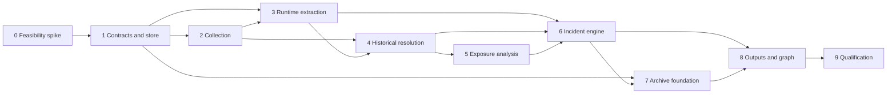

# CIRewind implementation plan

Status: accepted implementation and release-qualification baseline
Planning date: 2026-08-20
Product target: GitHub.com, v0.1
Implementation status: experimental v0.1.1 published; see [IMPLEMENTATION_STATUS.md](IMPLEMENTATION_STATUS.md)

> **Release-qualification update (2026-08-22):** the controlled GitHub.com
> explicit-repository spike established the central A→B→A and conservative-gap
> semantics. [ADR 0011](adr/0011-experimental-v0-1-qualification-envelope.md)
> accepts a bounded experimental-v0.1 envelope and makes the broader organization,
> credential, runner, immutable-package, resource-join, and scale matrix explicit
> post-v0.1 compatibility work. This planning baseline remains useful, but its
> broad aggregate gates must not be read as current support claims or as
> overriding ADR 0011.

## Epistemic labels

This plan uses four labels when a distinction matters:

- **Verified fact**: supported by a primary source cited in this documentation set.
- **Design decision**: behavior CIRewind will implement; it is not a claim about GitHub.
- **Inference**: a conservative conclusion derived from evidence and labeled as such.
- **Open validation**: behavior that the feasibility spike must test against live GitHub.com.

The endpoint-level source of truth is [GITHUB_DATA_SOURCES.md](GITHUB_DATA_SOURCES.md). Finding semantics are normative in [EVIDENCE_MODEL.md](EVIDENCE_MODEL.md).

## Planning-time repository inspection

Inspection was performed before creating any material on 2026-08-20. The table
below is a historical planning record, not the current repository state. Git and
the implementation were established later under an explicit build instruction;
the current state is recorded in [IMPLEMENTATION_STATUS.md](IMPLEMENTATION_STATUS.md).

| Item | Result |
| --- | --- |
| Target directory | Fresh local CIRewind working directory; machine-specific path omitted |
| Git status | Unavailable: the directory is not a Git repository |
| Current branch | None |
| Remotes | None |
| Existing files | None; only `.` and `..` were present |
| Existing languages and dependencies | None |
| Repository empty | Yes |
| Project instructions | No `AGENTS.md`, `CONTRIBUTING.md`, `SECURITY.md`, or local policy file in the directory or its checked ancestors |
| Unrelated work to preserve | None found |

No repository initialization, source scaffolding, dependency installation, or
product implementation was performed during the planning-only session. This
statement does not describe the later build session.

## Executive summary

CIRewind is an offline-first incident-response CLI that reconstructs historical GitHub Actions execution at run-attempt and job precision. It collects retained GitHub evidence, resolves historical caller workflows, called reusable workflows, repository Actions, composite Actions, local Actions, and immutable Action packages, then evaluates declarative incident packs. Its primary output is a provenance-bearing evidence bundle; its temporal graph is a derived query and visualization format.

The architecture is deliberately evidence-first:

1. Preserve source observations and collection gaps before analysis.
2. Keep `run_id + run_attempt + job_id` as the primary execution identity.
3. Separate a runner preparing an Action from a step demonstrably beginning execution.
4. Separate credential metadata, eligibility, flow, and demonstrated use.
5. Emit one of the ten normative semantic states, never a blended risk score.
6. Support incremental archival so a future incident can be replayed after GitHub logs expire.

The largest technical uncertainty is not API access; it is reliable correlation
between runner preparation records, step/timeline records, historical workflow
syntax, and exact nested Action identities across rerun forms. The controlled
spike proved the attempt-precision and downloaded-versus-executed gates for its
explicit-repository runner grammar. Unsupported grammars and compatibility
profiles remain visible gaps under ADR 0011; failure of those core predicates
inside the qualified grammar remains a product-contract no-go, not a reporting
caveat.

## Product contract

> Given a GitHub Actions incident definition and a GitHub organization or set of repositories, CIRewind determines which historical workflow run attempts downloaded or executed an affected Action commit, reconstructs the historical workflow and dependency chain, identifies the credentials and resources potentially reachable by each affected job, and emits a verifiable incident-response evidence bundle.

Primary positioning: **Reconstruct exactly what ran in GitHub Actions after a supply-chain compromise.**

The word “exactly” applies only where retained evidence supports exactness. Missing or ambiguous evidence must produce `UNKNOWN_EVIDENCE_GAP`, `POTENTIAL_TRANSITIVE`, `RUN_IN_WINDOW_MUTABLE_REF`, or another applicable lower state, never silent certainty.

## Target users

- Incident responders scoping a disclosed GitHub Action compromise across many repositories.
- Security engineering teams preserving short-lived CI evidence before an incident occurs.
- Software supply-chain and application-security teams validating historical exposure without executing third-party code.
- Digital-forensics practitioners who need repeatable evidence IDs, content hashes, collection metadata, derivations, and gap accounting.
- Open-source maintainers publishing reviewable incident knowledge without shipping executable detection logic.

## Primary use cases

### Investigate retained GitHub evidence

Enumerate repositories and runs in a bounded UTC interval; collect every visible attempt and attempt-specific job/log object; reconstruct historical definitions and runtime Action resolution; evaluate an incident pack; write a case bundle.

### Archive before retention loss

Incrementally collect and deduplicate compact execution facts, exact Action resolutions, workflow definitions, relevant Action metadata, permission observations, and coverage records. Raw logs remain opt-in.

### Replay a new incident offline

Evaluate a versioned incident pack against a frozen archive without making network requests. Identical archive bytes, pack bytes, policy, semantic engine version, and injected clock must produce identical normalized findings.

### Validate incident packs

Parse, structurally and semantically validate, canonicalize, and hash a pack without executing content or initiating pack-directed network access.

### Defensible handoff

Give responders HTML, JSON, CSV, JSONL, SQLite, hashes, collection metadata, and a concise coverage statement that another operator can verify offline.

## v0.1 scope

### Collection and identity

- GitHub.com organizations and explicit repository lists.
- UTC parent-run enumeration with recursive created-time partitioning around the API search ceiling. Until the spike proves the workflow-run lifetime is anchored to original parent creation across reruns, investigation uses the conservative combined discovery interval `[incident_from - 65 days, incident_to)` (30-day rerun eligibility plus a 35-day run lifetime). Findings still apply each component window to the relevant attempt/job/step event time.
- Every visible run attempt, attempt-specific job list, attempt ZIP logs, and job-log fallback.
- Separate repository, workflow path, workflow definition Git object ID, trigger Git object ID, caller workflow Git object ID, called workflow Git object ID, Action-source Git object ID, typed immutable-package digest, run ID, attempt, job ID, step identity, event, actor, triggering actor, event time, and collection time. Git object IDs carry algorithm plus full value; package digests use a distinct namespace.
- Read-only baseline operation; optional read-only audit-log and organization-owner enrichments.
- Explicit coverage units for each expected source object and every omission/error.

### Historical reconstruction

- Historical caller workflow retrieval using the strongest available exact-commit evidence.
- Attempt-specific `referenced_workflows` resolution and exact called-workflow retrieval.
- Repository, JavaScript, Docker, composite, local `./`, and GitHub.com self-repository `$/` Action syntax.
- Recursive composite and reusable-workflow reconstruction with bounded depth and cycle detection.
- `action.yml`/`action.yaml` retrieval at the evidenced source commit, with conflict detection if both exist.
- Full SHA, mutable ref, traditional runner download, and immutable Action package observations.
- Static recognition—but no execution or generic semantic analysis—of wrappers that download tools internally.

### Evidence and exposure

- The ten finding states and `L4_CERTAIN`–`L0_UNKNOWN` internal provenance ladder in [EVIDENCE_MODEL.md](EVIDENCE_MODEL.md).
- Downloaded-versus-executed distinction based on separately collected signals.
- Effective `GITHUB_TOKEN` permissions from setup logs; explicitly inferred static fallback.
- Direct named-secret references, job/workflow/step environment flow, reusable-workflow mappings, and `secrets: inherit` one boundary at a time.
- Environment target and gate/eligibility state without secret values.
- `OIDC_MINTING_CAPABILITY`; cloud trust analysis remains an adapter boundary.
- GitHub-hosted versus self-hosted runner classification and retained runner metadata/gaps.
- Non-causal correlation to artifacts, packages, releases, deployments, environment deployments, repository writes, and pull-request changes when APIs and permissions permit.

### Incident knowledge, persistence, and output

- Declarative `cirewind.dev/v1alpha1` incident packs with deterministic safe validation.
- The v0.1 binary and schema do not require a bundled real-world incident pack. Real packs are independently versioned content and may be admitted only after the source, review, fixture, and provenance gates in [INCIDENT_PACK_SPEC.md](INCIDENT_PACK_SPEC.md); unmistakably synthetic fixtures remain sufficient for product qualification.
- Compact incremental SQLite archive and deterministic offline replay.
- SQLite case database plus append-only JSONL evidence ledger.
- `report.html`, `findings.json`, `affected-runs.csv`, `evidence.jsonl`, `manifest.sha256`, `case.db`, `collection-metadata.json`, `graph.json`, and deterministic `summary.md` output.
- Optional `raw/` only when explicitly enabled.
- Derived temporal evidence graph whose every material edge cites evidence.
- Deterministic offline fixtures and a harmless controlled GitHub lab.
- Hostile-input defenses, fuzz targets, partial-coverage reporting, and no telemetry by default.

## Explicit v0.1 non-goals

- Generic workflow vulnerability scanning or a general Actions BOM.
- Replacing ABOM, Trajan, zizmor, GATO, gh-blast-radius, or current-state inventory tools.
- Active exploitation, attack verification, exfiltration simulation, secret rotation, or secret-value access.
- Proving cloud-role assumption from `id-token: write`; live cloud validation; generalized cloud trust-policy evaluation.
- eBPF, runner endpoint detection, or self-hosted runner remediation.
- GitLab, Azure DevOps, Jenkins, or GitHub Enterprise Server.
- Hosted SaaS, mandatory GitHub App, hosted control plane, multi-user collaboration, or enterprise SSO.
- Machine-learning or numeric risk scoring.
- General-purpose SBOM or package-malware analysis.
- Causal claims about deployments or writes without direct evidence.
- Runtime LLM dependency, telemetry by default, Neo4j, Kubernetes, or a network service.

## Capability tiers and graceful degradation

| Tier | Minimum authority | Adds | Must not imply |
| --- | --- | --- | --- |
| Baseline repository | Read access plus Actions/Contents read for each repository | Runs, attempts, jobs, logs, repository content, referenced workflows, artifacts and other permitted repository metadata | Organization-complete visibility, exact historical secret existence, or audit-log facts |
| Organization inventory | Token can enumerate all in-scope organization repositories | Defensible repository coverage denominator | Access to every private repository unless API results prove it |
| Audit enrichment | Organization/enterprise audit-log read authority | `prepared_workflow_job` workflow-chain, runner, environment, and secret-name observations | Attempt/job correlation when the audit record lacks an unambiguous key |
| Owner enrichment | Organization-owner and feature-specific read authority | Organization secret metadata, runner groups, selected-repository mappings, policy/settings context | Historical settings when an endpoint returns only current state |
| Offline replay | A valid CIRewind archive only | Repeatable incident matching and reporting | Recovery of evidence not archived earlier |

Each unavailable tier creates named coverage records. Optional enrichment failure cannot erase baseline results.

## Work breakdown

The intended Go package boundaries are architectural responsibilities, not a request to scaffold empty packages:

| Workstream | Responsibility | Principal contract |
| --- | --- | --- |
| CLI/configuration | Command parsing, validation, exit policy, cancellation, explicit limits | Validated immutable run configuration |
| GitHub transport | Versioned REST/GraphQL requests, pagination, redirects, retry/rate handling, response hashing | Source observation or typed collection gap |
| Scope scheduler | Repository enumeration, recursive time partitioning, run/attempt/job work queue | Complete, deduplicated coverage plan |
| Safe ingestion | Streaming HTTP and ZIP handling, byte limits, hostile-text normalization | Bounded bytes plus provenance metadata |
| Runtime extractors | Versioned log grammars for Actions, packages, permission blocks, runners, and step starts | Observations; never final findings |
| Historical resolver | Workflow/Action AST, exact content retrieval, nested calls, local/self references, cycles | Versioned dependency nodes and evidence-backed edges |
| Exposure analyzer | Token, secret, environment, OIDC, runner, and downstream-resource models | Capability/eligibility/flow conclusions with basis |
| Incident engine | Safe pack validation, indicator matching, state derivation, contradiction rules | Deterministic semantic findings |
| Evidence ledger/store | SQLite transactions, append-only JSONL, content addressing, migrations, coverage | Durable case/archive records |
| Replay | Network-disabled analysis of archive snapshot | Same semantic engine over preserved observations |
| Reporting/graph | JSON/CSV/HTML/Markdown and derived graph projections | Escaped, self-contained, evidence-linked bundle |
| Verification | Manifest generation/verification, fixture clock, schema checks | Reproducible integrity result |

## Implementation phases

Complexity uses relative engineering size: **S**, **M**, **L**, **XL**. Uncertainty is stated separately; these are not calendar estimates.

### Phase 0 — fixed two-week feasibility spike

| Attribute | Plan |
| --- | --- |
| Inputs | Two private fixture repositories, one organization test owner, synthetic safe/moved Action tags, documented API token variants, current GitHub.com, representative hosted and self-hosted runs |
| Outputs | Sanitized immutable fixtures; endpoint transcripts without credentials; log grammar corpus; capability/permission results; spike decision record; updated source matrix |
| Acceptance criteria | All hard go/no-go gates below are answered with reproducible evidence; attempted APIs record version, status, headers relevant to limits, and permissions; scenarios A, D, E, F, I, K, N, O, P, and concurrent-step Q have live or captured proof |
| Failure modes | Logs absent; attempts collapsed; execution markers ambiguous; reusable SHA not attempt-specific; API ceiling cannot be detected; permission cannot support organization coverage; fixtures leak sensitive data |
| Tests | Controlled tag move, skipped Action, all rerun forms, exact workflow retrieval, audit/no-audit comparison, log expiry simulation, archive/replay prototype using hand-authored fixture records only |
| Dependencies | None beyond authorized test organization and GitHub.com |
| Complexity | L, very high uncertainty |
| Parallelizable work | API/permission probing; runner-log grammar; workflow identity; safe archive shape; fixture sanitization |
| Explicitly out of scope | Production CLI, broad incident packs, performance tuning, real credentials, harmful payloads |

### Phase 1 — foundations and normative contracts

| Attribute | Plan |
| --- | --- |
| Inputs | Accepted planning docs and Phase 0 decision record |
| Outputs | Go module; CLI command/config contracts; typed domain identifiers; semantic enums; evidence/coverage interfaces; SQLite migrations; deterministic clock/ID/revision policy; dependency/license inventory |
| Acceptance criteria | Schema can represent typed Git object IDs, package-digest namespaces, all historical identifiers, ten states, logical findings, and append-only finding revisions; uniqueness enforces `(repository_id, run_id, attempt, job_id)` without cross-attempt merging; migrations round-trip golden databases; invalid enum/string states are rejected |
| Failure modes | Nullable identifiers hide gaps; evidence and finding objects are conflated; schema cannot retain multiple observations over collection time; dependency breaks static cross-build goal |
| Tests | Schema constraints, migration upgrade/rollback policy tests, canonical ID vectors, case-file permission tests, configuration validation |
| Dependencies | Phase 0 go |
| Complexity | M, medium uncertainty |
| Parallelizable work | Domain model, migrations, safe I/O, CLI contracts |
| Explicitly out of scope | Network collection and incident matching |

### Phase 2 — GitHub collection and coverage accounting

| Attribute | Plan |
| --- | --- |
| Inputs | Versioned endpoint matrix, transport limits, repository scope, incident intervals with explicit bounds, and the provisional 65-day-expanded parent-run discovery interval |
| Outputs | Repository/run/attempt/job metadata; attempt and job log source objects; content responses; collection sessions; coverage ledger; request/cache records |
| Acceptance criteria | A fixture with more than 1,000 runs is partitioned without loss or duplication; parent runs in the provisional 65-day horizon are watched so an in-window rerun or delayed job is found; any reduction to 35 days is backed by spike evidence about the lifetime anchor; every observed run has attempts `1..run_attempt` or an explicit gap; every expected attempt has a job/log result or typed gap; redirects are fetched immediately without forwarding authorization |
| Failure modes | One-second density ceiling; repository invisible to token; run changes while collecting; expired/deleted logs; secondary limit; transient redirect expiry; repository deletion/rename |
| Tests | Mock pagination/ceilings/boundaries, ETag/conditional requests, 302 renewal, 403/404/410/429/5xx, cancellation, race where a new attempt appears mid-collection |
| Dependencies | Phase 1 |
| Complexity | XL, high uncertainty at organization scale |
| Parallelizable work | Transport, partitioner, attempts/jobs, safe ZIP streaming, coverage model |
| Explicitly out of scope | Interpreting logs or declaring exposure |

### Phase 3 — versioned runtime-evidence extraction

| Attribute | Plan |
| --- | --- |
| Inputs | Bounded attempt/job log streams and job step metadata |
| Outputs | Exact traditional Action resolution, download-announcement, and preparation-completion observations; immutable package version/source-ID/digest observations; step-begin observations; effective token permissions; runner facts; parser diagnostics |
| Acceptance criteria | Golden corpus handles known runner generations; a download announcement alone is never promoted to completed preparation; a skipped but completed preparation is never emitted as executed; malformed/truncated logs yield partial observations plus gaps; parser version and source byte spans support every extracted fact |
| Failure modes | GitHub changes text grammar; user-controlled names mimic control lines; composite markers cannot be correlated; logs truncate mid-group; locale/encoding variation |
| Tests | Golden logs, adversarial log forging, truncation at every boundary, duplicate names, matrix jobs, fuzzing, property that execution evidence always requires an independent begin signal |
| Dependencies | Phases 1–2 and Phase 0 grammar result |
| Complexity | XL, very high uncertainty |
| Parallelizable work | Download grammar, immutable-package grammar, permission/runner grammar, step correlation, fuzz harnesses |
| Explicitly out of scope | Interpreting arbitrary command output or detecting secret values |

### Phase 4 — historical workflow and Action resolution

| Attribute | Plan |
| --- | --- |
| Inputs | Exact/candidate workflow identities, historical content APIs, runtime Action observations, untrusted YAML/metadata |
| Outputs | Parsed historical definitions; reusable-workflow chains; Action refs/commits/definitions; composite/local/self-reference edges; resolution gaps and contradictions |
| Acceptance criteria | Caller and called definitions are retrieved at evidenced commits; mutable refs are never resolved using their current target as historical fact; `$/` binds to the containing definition commit; `./` records workspace/checkout uncertainty; cycles and depth limits terminate deterministically |
| Failure modes | Caller commit unavailable; content deleted/inaccessible; YAML expressions make a `uses` target dynamic; local workspace changed before use; both metadata filenames conflict; nested dependency unavailable |
| Tests | Historical-vs-current fixture, tag-move fixture, event-specific workflow identities, reusable depth ten, composite depth ten, cycles, dynamic expressions, conflicting metadata, local checkout variants |
| Dependencies | Phases 1–3 |
| Complexity | XL, high uncertainty |
| Parallelizable work | Workflow AST, exact content cache, reusable resolver, Action/composite resolver, local/self resolver |
| Explicitly out of scope | Checking out, importing, building, or executing Action code; generalized JavaScript dependency analysis |

### Phase 5 — credential, environment, runner, and resource analysis

| Attribute | Plan |
| --- | --- |
| Inputs | Historical AST/chain, effective permission observations, job/environment/audit metadata, resource APIs |
| Outputs | Token permission facts/inferences; named-secret existence/reference/pass/inherit/eligibility flows; gate states; OIDC capability; runner classification; non-causal resource correlations |
| Acceptance criteria | Effective logged permissions outrank static reconstruction; each secret edge has scope and destination; inheritance advances only one call boundary; unapproved jobs have no environment-secret eligibility; `id-token: write` emits only minting capability; resource wording is “observed after” unless direct linkage exists |
| Failure modes | Current settings mistaken for historical; dynamic secret expressions; audit record ambiguously correlated; environment config changed; resource lacks run/attempt key |
| Tests | Scenarios G–K and L, default permission permutations, fork downgrades, nested inheritance, current-only secret metadata, rejected/bypassed gates, OIDC without trust policy |
| Dependencies | Phases 2–4 |
| Complexity | XL, high semantic uncertainty |
| Parallelizable work | Token engine, secret-flow engine, environments, runners/OIDC, resource correlation |
| Explicitly out of scope | Secret values, actual token use, cloud trust, causation, automatic remediation |

### Phase 6 — incident-pack validator and finding engine

| Attribute | Plan |
| --- | --- |
| Inputs | Validated incident pack, normalized observations, dependency graph, coverage records |
| Outputs | Indicator matches, deterministic findings, contradictions, no-match/unknown decisions, rotation-trigger recommendations as text |
| Acceptance criteria | Exactly the normative state strings are accepted/emitted; state precedence never promotes missing evidence; per-component windows preserve and apply their declared inclusive/exclusive bounds, source precision, and approximation to the relevant event timestamp; conflicting indicators are rejected; every finding has supporting or gap evidence |
| Failure modes | Unsafe YAML expansion; ambiguous repository/path matching; pack source conflict; current-reference contamination; no-match emitted despite an unexamined coverage unit |
| Tests | Schema/golden packs, unsafe and ambiguous packs, state-decision tables, metamorphic indicator ordering, window boundaries, contradiction fixtures, offline-only validation |
| Dependencies | Phases 1 and 3–5 |
| Complexity | L, medium uncertainty |
| Parallelizable work | Validator/canonicalizer, matchers, state engine, fixtures |
| Explicitly out of scope | Pack-supplied code, network requests, HTML, shell, unrestricted regex, fabricated real incidents |

### Phase 7 — archive and replay

| Attribute | Plan |
| --- | --- |
| Inputs | Collected compact observations, source hashes, workflows/metadata, collection watermarks; or an existing archive plus pack |
| Outputs | Incremental archive database; integrity metadata; deduplicated observations; network-disabled replay case |
| Acceptance criteria | Overlapping incremental collections are idempotent; mutable observations remain bitemporal rather than overwritten; replay succeeds with network access disabled; archive lacking a required object produces `UNKNOWN_EVIDENCE_GAP`; fixed-input normalized replay is byte deterministic |
| Failure modes | Watermark skips late data; schema migration loses provenance; archive tampering; source hash retained without usable derived facts; analysis version silently changes results |
| Tests | Overlap/watermark properties, interruption recovery, migration fixtures, corrupt/untrusted archive, read-only replay, deterministic clock, old-engine compatibility policy |
| Dependencies | Phases 1–6; collection can persist archive records earlier but replay acceptance waits for the semantic engine |
| Complexity | L, medium uncertainty |
| Parallelizable work | Archive writer, dedup/migrations, replay reader, determinism tests |
| Explicitly out of scope | Distributed archive, remote synchronization, multi-user locking |

### Phase 8 — case outputs, graph, and verification

| Attribute | Plan |
| --- | --- |
| Inputs | Finalized case database, findings, evidence ledger, coverage summary |
| Outputs | Required case files, optional raw directory, derived graph projection, manifest and verifier |
| Acceptance criteria | HTML opens offline with no network requests and strict CSP; all hostile fields are escaped; CSV resists spreadsheet formulas; JSON/JSONL are valid; every material graph edge links evidence; manifest covers every regular case file except itself and temporary DB sidecars are absent |
| Failure modes | Stored XSS; JavaScript-context escape; terminal/CSV injection; nondeterministic ordering; graph implies unsupported causality; WAL not checkpointed |
| Tests | Browser security regression suite, CSP/no-network test, hostile Unicode/control strings, CSV corpus, manifest tampering, large-graph degradation, golden output |
| Dependencies | Phases 1 and 6–7 |
| Complexity | L, medium uncertainty |
| Parallelizable work | JSON/CSV/Markdown, HTML/CSP, graph projection, manifest verifier |
| Explicitly out of scope | Hosted dashboards, remote assets, graph database |

### Phase 9 — hardening, scale qualification, and release readiness

| Attribute | Plan |
| --- | --- |
| Inputs | End-to-end v0.1 candidate and all fixture corpora |
| Outputs | Fuzz/scale reports, cross-platform binaries, SBOM for CIRewind itself, licenses/notices, security policy, operator documentation, signed release process |
| Acceptance criteria | Scenarios A–P and concurrency scenario Q pass; hostile-input limits fail closed with typed gaps; race detector/static checks pass; supported OS/architecture matrix passes; no telemetry or outbound pack traffic; fresh operator reproduces central acceptance test from docs |
| Failure modes | Memory grows with archive size; platform file permissions diverge; SQLite driver cross-build fails; false execution classification; dependency/license issue |
| Tests | Full strategy in [TEST_STRATEGY.md](TEST_STRATEGY.md), including million-record metadata benchmark profile and fuzz corpus regression |
| Dependencies | Phases 0–8 |
| Complexity | XL, medium-to-high uncertainty |
| Parallelizable work | Security, scale, cross-platform, docs, release engineering |
| Explicitly out of scope | Adding post-v0.1 platforms or cloud adapters to satisfy release pressure |

## Phase dependencies

The store, safe ingestion, and fixtures can proceed in parallel after Phase 0. The final semantic engine cannot stabilize before runtime extraction and historical resolution agree on identities.

## Fixed two-week feasibility spike

This is a ten-working-day experimental timebox, not a product delivery promise. It ends with evidence and a go/no-go decision even if some experiments fail.

### Work allocation

| Timebox | Experiments | Exit artifact |
| --- | --- | --- |
| Days 1–2 | Token/permission matrix; run ceiling and partition behavior; cost/semantics of the provisional 65-day parent-run watch; attempt/job/log endpoints; redirect behavior | Sanitized endpoint transcript and permission table |
| Days 1–4 | Runner source mapping; traditional and immutable package log grammars; setup versus step-start markers | Versioned grammar notes and hostile/golden corpus |
| Days 3–6 | Mutable tag A→B→A; skipped step; matrix; background/concurrent steps and explicit wait; failures; full, failed-job, and single-job reruns | Attempt-keyed fixture bundle and expected observations |
| Days 4–7 | Caller WorkflowRun file identity; `referenced_workflows`; reusable rerun behavior; audit workflow-chain fields | Exact-SHA capability matrix with ambiguity cases |
| Days 5–8 | Composite, local `./`, self `$/`, pull-request-target, and historical/current divergence | Resolver decision table and bounded limitations |
| Days 7–9 | Effective permissions; direct/inherited secrets by name only; environment rejection/approval; runner types; OIDC capability | Exposure semantics fixtures with no values |
| Days 8–10 | Compact archive prototype expressed as fixture records; network-disabled replay; evidence manifest; review | Spike ADR, updated plan, sanitized public lab recipe |

### Hard go/no-go criteria

Proceed to v0.1 implementation only if all hard gates pass:

1. **Attempt separation and discovery:** every retrievable attempt can be enumerated, its jobs can be associated without merging attempts, and `(run_id, run_attempt, job_id)` survives full and partial reruns. The provisional 65-day reconciliation finds in-window reruns/delayed jobs; a shorter bound is permitted only if live evidence proves it cannot evict an eligible parent.
2. **Exact preparation:** the controlled B commit is extracted for each attempt that prepared it, including the skipped-step scenario, with no dependence on the present tag; the runner's pre-download announcement is stored separately and is insufficient until a completion signal proves preparation succeeded.
3. **Execution distinction:** a separately verifiable step-begin signal distinguishes a harmless B Action that began from one merely prepared; the fixture corpus has zero promotions of skipped B to `CONFIRMED_EXECUTED`.
4. **Mutable rerun behavior:** after B is replaced by A, a full rerun and partial reruns produce attempt-specific results consistent with documented reusable-workflow behavior and observed Action resolution; unexplained reuse/re-resolution is not acceptable.
5. **Historical definition:** at least one authoritative route retrieves the caller workflow file actually used, while exact called-workflow SHAs are obtained per attempt or gaps are detectable. Event classes without exact caller identity must be enumerated, not hidden.
6. **Offline preservation:** compact records retained before raw-log deletion are sufficient to reproduce archived Action source-ID/digest, preparation/execution classification, evidence links, and gaps with networking disabled. A later pack requiring a literal that was not structurally archived must yield `UNKNOWN_EVIDENCE_GAP`; a hash of discarded log bytes is not searchable proof.
7. **Coverage honesty:** inaccessible or deleted logs deterministically produce `UNKNOWN_EVIDENCE_GAP`, and `NO_MATCH_CONFIRMED` is impossible while a required coverage unit is unexamined.
8. **Safe ingestion:** the ZIP/log/YAML proof path enforces streaming size/depth/count limits and never executes fetched content.
9. **Concurrent-step ordering:** background/parallel fixtures retain step intervals and explicit synchronization; YAML order alone creates no secret/file/resource flow or causal edge.

### Conditional gates

These may proceed with an explicitly bounded v0.1 behavior:

- Composite/local nested execution may remain `CONFIRMED_DOWNLOADED` or `POTENTIAL_TRANSITIVE` when a nested begin marker cannot be uniquely correlated, provided reconstruction and ambiguity evidence are correct.
- Current-only secret/environment settings may enrich a report only as collection-time metadata; they cannot be presented as historical facts.
- Organization audit access may remain optional if baseline repository enumeration is complete and the loss of `secrets_passed`/workflow-chain evidence is visible.
- Downstream resources may remain temporal/direct-ID correlations without causation.

### No-go outcomes

- If exact Action download SHAs cannot be preserved reliably at attempt scope, stop: the core contract is not viable.
- If ordinary skipped and executed repository Actions cannot be separated without unacceptable false execution claims, stop or redefine the product before building.
- If the collection algorithm cannot detect its own 1,000-result truncation or repository visibility gaps, do not claim organization scope.
- If offline replay requires refetching mutable refs or logs, archive/replay has failed its strategic requirement.

## Definition of done for v0.1

v0.1 is done only when:

- All Phase 0 hard gates passed and the evidence is checked into harmless sanitized fixtures.
- `investigate`, `archive`, `replay`, and `pack validate` meet their documented contracts.
- Every required case output is generated and `manifest.sha256` verifies offline.
- The ten finding state strings are identical across schema, database, CLI, JSON, CSV, HTML, fixtures, and docs.
- Every logical finding has append-only revisions; each revision and every material graph edge traces to one or more evidence IDs; every derivation is acyclic and versioned.
- Attempt-specific conclusions never merge materially different attempts.
- All eight mandatory invariants have positive and negative regression tests.
- Coverage totals reconcile: expected = collected + not-applicable + each typed gap, for repositories, runs, attempts, jobs, logs, and definitions.
- Archive replay works with networking disabled after raw source objects are removed for every preserved structured evidence class; a pack requiring discarded literal text produces `UNKNOWN_EVIDENCE_GAP` rather than a false negative.
- Scenario matrix A–P plus concurrency scenario Q passes on deterministic fixtures; the central A→B→A lab passes on GitHub.com.
- No test, documentation, or report contains a secret value or harmful exfiltration behavior.
- Hostile-input fuzzing, report-injection tests, cross-platform tests, and published reference-scale benchmarks pass their budgets.
- Dependencies, licenses, DCO policy, Apache-2.0 project licensing, security reporting, build provenance, and release verification are documented.
- A skeptical maintainer can reproduce a finding from source hash through parser observation and derivation to report output.

## Major risks

| Risk | Impact | Mitigation / decision point |
| --- | --- | --- |
| Setup logs announce Action downloads before the download itself, while job preparation can cover Actions whose steps later skip | False claims of download completion or execution | Separate resolution, announcement, preparation-completion, and step-begin signals; hard spike gate; never infer completed download or execution from an announcement line |
| Caller workflow SHA differs by event and is not exposed uniformly | Historical YAML may be wrong | Prefer executed `WorkflowRun.file`/audit workflow SHAs; event-aware candidates; exactness grade and gap |
| Full versus partial reruns resolve mutable dependencies differently | Attempts may execute different code | Retrieve every attempt; retain referenced workflow SHAs and runtime Action SHAs; never roll up before attempt findings |
| Logs expire, are deleted, or are inaccessible | Exact runtime proof disappears | Core archive mode; coverage ledger; `UNKNOWN_EVIDENCE_GAP`; raw opt-in only |
| API search ceiling, very dense timestamps, and parent runs predating an in-window rerun/delayed job | Silent run or attempt omission | Recursive partitions, overlap/dedup, split at `>=1000`, one-second terminal gap, provisional rolling 65-day parent-run watch, audit-log alternative when authorized; reduce only after lifetime-anchor proof |
| Runner log format is not a stable API | Parser silently misses facts | Versioned grammars, source-backed markers, fixtures across runner versions, unknown grammar diagnostics, fuzzing |
| Local `./` Actions use mutable runner workspace | Static Git contents may not equal executed local code | Model checkout target and preceding mutation uncertainty; prefer `$/`; cap certainty; never execute workspace code |
| Current secret/environment settings are mistaken for historical state | Inflated or false credential exposure | Separate event and collection time; prefer setup/audit observations; current metadata labeled current-only |
| Audit events lack job ID/attempt | Wrong secret/runner/workflow correlation | Require unique multi-field/time correlation or leave unlinked with gap; never join on untrusted job name alone |
| Hostile logs/ZIP/YAML/report fields attack the analyst | Tool compromise or evidence corruption | Streaming limits, parser caps, canonical paths, no code execution, CSP/escaping, safe structured logging, fuzzing |
| Signed log redirects expire and may target changing storage hosts | Collection failures or SSRF/auth leakage | Fetch immediately; renew through API; no auth forwarding; HTTPS and redirect policy; evidence gap on failure |
| Pure-Go SQLite driver increases binary/dependency size or lags SQLite fixes | Distribution/security cost | Phase 0 build/CVE/license benchmark; pin exact version; retain store interface; revisit ADR if criteria fail |
| Temporal resource correlation is mistaken for causation | Incident overstatement | Typed relationships (`OBSERVED_AFTER` vs direct); conservative report vocabulary; evidence-linked rationale |

## Roadmap beyond v0.1

Ordered by evidence value, not marketing breadth:

1. Static cloud trust-policy adapters for AWS, Azure, GCP, Vault, and IaC, enabling `CLOUD_IDENTITY_REACHABLE` only when relying-party conditions accept the reconstructed OIDC claims.
2. Signed community incident-pack index and reproducible pack release process after the unsigned local-pack threat model is proven.
3. Optional integration/import bridges for ABOM and other static dependency evidence, retaining external provenance and never treating imports as runtime proof.
4. Additional downstream provenance using artifact attestations, package metadata, and deployment records where direct run/job identifiers exist.
5. GHES compatibility matrix and adapters only after version-specific attempt/log/runner semantics can be tested; no generic base-URL switch marketed as support.
6. Privacy-preserving archive policies, selective disclosure, and export profiles for cross-team handoff.
7. Incremental streaming audit-log ingestion for customers with the required GitHub Enterprise Cloud access.
8. Cross-case local query tooling; still no mandatory server or graph database.

## Planning references

Primary sources retrieved 2026-08-20:

- [GitHub REST workflow-run endpoints](https://docs.github.com/en/rest/actions/workflow-runs?apiVersion=2026-03-10) — attempts, logs, reruns, created filtering, and search ceiling.
- [GitHub REST workflow-job endpoints](https://docs.github.com/en/rest/actions/workflow-jobs?apiVersion=2026-03-10) — step and runner fields, including attempt-specific job listing.
- [GitHub GraphQL Actions schema](https://docs.github.com/en/graphql/reference/actions) — `WorkflowRun.file`, `WorkflowRunFile`, and `runAttempt`.
- [GitHub reusable-workflow reference](https://docs.github.com/en/actions/reference/workflows-and-actions/reusing-workflow-configurations) — nesting, permission reduction, and rerun behavior.
- [GitHub workflow syntax](https://docs.github.com/en/actions/reference/workflows-and-actions/workflow-syntax) — permission calculation, local `./`, and self-repository `$/` semantics.
- [GitHub Actions limits](https://docs.github.com/en/actions/reference/limits) — the 35-day workflow-run limit; combined conservatively with the separate 30-day rerun eligibility while their common anchor remains unverified.
- [GitHub repository hash-algorithm endpoint](https://docs.github.com/en/rest/repos/repos?apiVersion=2026-03-10#get-the-hash-algorithm-used-by-a-repository) — typed Git object-ID storage rather than a hard-coded SHA-1 width.
- [GitHub organization audit-log events](https://docs.github.com/en/organizations/keeping-your-organization-secure/managing-security-settings-for-your-organization/audit-log-events-for-your-organization) — `workflows.prepared_workflow_job` fields.
- [GitHub-maintained audit-actions-workflow-runs](https://github.com/github/audit-actions-workflow-runs) — log extraction precedent; the repository explicitly describes itself as unofficial and unsupported.
- [SQLite documentation](https://sqlite.org/docs.html) and [modernc.org/sqlite package documentation](https://pkg.go.dev/modernc.org/sqlite) — provisional embedded-store direction.
