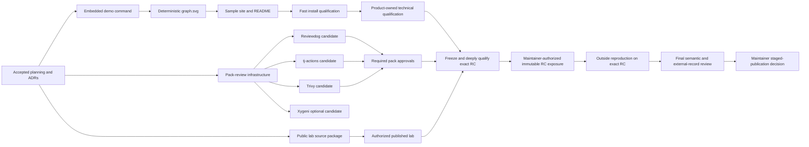

# CIRewind v0.2.0 adoption plan

Status: accepted for implementation on 2026-08-22; no v0.2 product work,
external review, reproduction, publication, or release is implied complete.

Planning baseline: 2026-08-22. Repository behavior described here was inspected
on `main` at the planning baseline. External services and release facts must be
rechecked when implementation begins.

## North star

A new user can move from the repository landing page to a complete, visual,
manifest-verified synthetic case in under two minutes without cloning the
repository, providing GitHub credentials, or permitting network access during
case generation.

Two measurements make that statement testable:

1. **Zero-install preview:** from the repository landing page, a user can open
   the static sample report and its temporal evidence path in one click. This
   path must work with JavaScript disabled and make no third-party requests.
2. **Local verified demo:** from a clean supported host, a user follows one
   documented install lane and runs `cirewind demo --out cirewind-demo`. The
   command produces the complete fixed case-file set and verifies its manifest.
   Measure `T_demo` from installed-binary invocation through successful case-
   manifest verification and `T_total` from the documented installation command
   through that same verification point. Across five clean trials per blocking
   lane, `T_demo` p50 must be at most 15 seconds with no run over 30 seconds;
   `T_total` p50 must be at most 120 seconds with no run over 180 seconds.

The launch-blocking reference lanes are Ubuntu 24.04 amd64 with 2 vCPU and
4 GiB RAM, and macOS 15 arm64 with Homebrew already installed. Windows 11 amd64
is informational for v0.2. Every trial uses a clean output directory and no
CIRewind cache. Installation download time is part of `T_total`; high-assurance
attestation verification is a separate lane and is not hidden inside the
two-minute claim. Stop the timer only after every required case output exists
and the manifest verifies. Browser opening is a separate smoke test. Every
published measurement records OS, architecture, CI or hardware profile, network
context, binary/version acquisition path, command transcript, and all five raw
durations rather than only the p50.

## Product constraint

v0.2 is an adoption release around the accepted bounded v0.1 forensic engine.
It must make a trustworthy result easier to see, run, and evaluate. It must not
broaden a conclusion, hide partial coverage, or turn a visual relationship into
new evidence.

The following remain frozen and normative in
[`EVIDENCE_MODEL.md`](EVIDENCE_MODEL.md):

- the ten canonical finding states: `CONFIRMED_EXECUTED`,
  `CONFIRMED_DOWNLOADED`, `CONFIRMED_CALLED_WORKFLOW`,
  `DECLARED_AT_RUN_SHA`, `RUN_IN_WINDOW_MUTABLE_REF`,
  `POTENTIAL_TRANSITIVE`, `CURRENT_REFERENCE_ONLY`,
  `NO_MATCH_CONFIRMED`, `UNKNOWN_EVIDENCE_GAP`, and
  `CONTRADICTORY_EVIDENCE`;
- the five provenance identifiers: `L4_CERTAIN`, `L3_STRONG`,
  `L2_PROBABLE`, `L1_POSSIBLE`, and `L0_UNKNOWN`;
- the eight mandatory invariants;
- `run_id + run_attempt + job_id` as material job-execution identity;
- downloaded versus executed;
- secret relationship versus secret access;
- OIDC minting capability versus cloud-role assumption;
- temporal correlation versus causation;
- an evidence gap versus a confirmed no-match;
- event time versus collection time;
- hash-verifiable integrity support rather than authenticity or legal
  certification.

The eight mandatory invariants remain exact test oracles:

```text
Action downloaded != Action executed
Repository possesses a secret != affected step could read that secret
id-token: write != cloud role assumed
Workflow ran during incident window != compromised SHA executed
Current tag points to a safe commit != historical runs were safe
No retained logs != no compromise
Deployment followed an affected step != attacker caused the deployment
Present-day workflow YAML != historical workflow definition
```

No v0.2 renderer, demo assertion, README count, sample artifact, or real pack may
override those semantics.

## Target users

1. An incident responder who needs to decide whether CIRewind is relevant before
   spending time on authentication and organization-wide collection.
2. A security engineer evaluating whether runtime evidence adds value beyond a
   current-state workflow inventory.
3. An open-source maintainer preparing or reviewing a real incident pack.
4. A skeptical independent reproducer testing the A-to-B-to-A mutable-tag claim
   in a harmless public laboratory.
5. A forensic practitioner who requires the existing high-assurance download,
   provenance, manifest, and offline-report workflow.

## Problem statement

The v0.1 engine can produce a defensible case, but the first evaluation path
currently requires a source checkout, a repository-relative incident pack, and
`make demo`. The report exports a graph-shaped JSON projection but renders its
nodes and edges as lists. No reviewed real incident pack is shipped. The result
is technically evaluable but not immediately visible or useful to a new visitor.

v0.2 closes that adoption gap without presenting candidate intelligence as
fact. A synthetic demonstration, deterministic SVG, static sample site, concise
landing page, and convenient installation are product-owned work. Real incident
content and independent lab reproduction are human-governed work and remain
hard release gates.

## Exact scope

### Track 1 — product-owned adoption path

- Add `cirewind demo --out PATH` with embedded synthetic inputs, production
  derivation, fixed clocks, automatic manifest verification, no raw logs, no
  credentials, no child process, and no network.
- Add deterministic `graph.svg` as a fixed, manifested case file generated from
  the existing evidence-linked graph projection.
- Integrate the same temporal evidence path into `report.html` without remote
  assets or executable SVG content.
- Publish a deterministic synthetic sample site and case through a least-
  privilege GitHub Pages workflow.
- Redesign the README above the fold around the outcome, visual, counts, one
  command, and sample report while retaining the experimental qualification and
  high-assurance installation material.
- Qualify `go install github.com/torjan0/cirewind/cmd/cirewind@v0.2.0` and a
  maintainer-owned Homebrew tap as the fast-evaluation lanes. Do not publish a
  command using a tag before that tag exists and passes release qualification.
- Preserve the existing release archive, checksums, SBOM, attestation, and
  protected publication path as the high-assurance lane.

### Track 2 — externally gated evidence content

- Establish a review-packet format and immutable approval record for real
  incident packs.
- Prepare candidate packets, one per review branch, for the March 2025
  Reviewdog/action-setup compromise, the March 2025
  tj-actions/changed-files compromise, and the March 2026 Trivy ecosystem
  compromise.
- Treat Xygeni as a nonblocking v0.2 candidate excluded from the release by
  default. Promote it only if exact malicious identity, affected ref, source-
  precision-aware timing, recorded conflicts, deterministic fixtures, and
  independent review all satisfy the accepted pack-review contract. Otherwise
  retain it for a later release.
- Retain the existing two-maintainer approval rule and add at least one
  independent outside human review for every real pack. Trivy requires two
  independent outside human reviewers in addition to its maintainer gate.
  Candidate preparation, schema validation, and automated tests do not satisfy
  these gates.
- Prepare a separate harmless public laboratory source package and reproduction
  protocol. Require at least one outside human reproduction of the exact
  A-to-B-to-A outcome before coordinated v0.2 launch.

### Required v0.2 case files

Every investigation, replay, and demo case has the v0.1 fixed outputs plus
`graph.svg`:

```text
affected-runs.csv
case.db
collection-metadata.json
evidence.jsonl
findings.json
graph.json
graph.svg
report.html
summary.md
manifest.sha256
```

`manifest.sha256` covers every material file except itself. Demo output never
contains `raw/`.

## Non-goals

- Changing finding predicates, provenance levels, incident matching priority,
  exposure semantics, or archive truth.
- Calling the visual an attack path, blast radius, compromise path, or proof of
  causation.
- Adding a graph database, hosted dashboard, telemetry, remote report asset, or
  runtime JavaScript dependency.
- Organization-scale expansion, GHES, GitLab, Jenkins, Azure DevOps, cloud trust
  adapters, secret values, exploitation, active validation, or attack scoring.
- Making the sample site a live organization scanner or uploading user cases.
- Treating pack schema validation as factual verification.
- Shipping a real pack merely to satisfy a count or launch date.
- Claiming independent review or reproduction before a qualifying outside human
  records it against exact content.
- Replacing the existing verified-installation path with Homebrew or
  `go install`.
- Building a hosted pack registry in v0.2.

## Two-track dependency plan



Track 1 can reach product-owned technical qualification without outside
coordination. Freezing the exact coordinated v0.2 RC waits for required pack
approvals and the authorized public lab/index; the outside lab reproduction then
runs against that frozen RC after Maksim explicitly authorizes its immutable
pre-release ref/artifact exposure. Track
2 can prepare candidates and tooling in parallel, but only humans can complete
its approval gates. No missing Track 2 approval is converted to a checkbox,
inferred approval, or lower review standard by automation.

## Codex/human/external responsibility matrix

This is a capability and authority boundary, not an authorship or contribution
credit. Repository policy forbids crediting automated systems as authors,
co-authors, creators, or reviewers.

| Activity | Codex/automated implementation session | Maksim | Additional project maintainer(s) (unassigned) | Outside human |
|---|---|---|---|---|
| Implement and test product-owned work | May prepare changes and evidence | Reviews and accepts/rejects | May review after onboarding | May review |
| Change canonical evidence semantics | Must stop | Must initiate a separately scoped decision | Required project review | Independent forensic review required |
| Create local candidate pack packet | May research, transcribe, validate, and flag conflicts | Confirms scope and nominates reviewers | Cannot be the candidate's author/transcriber when filling the approval slot | Reviews facts |
| Mark a real pack reviewed | Prohibited | Records promotion only after all gates | Distinct approval required | Distinct external approval required |
| Approve Trivy pack | Prohibited | One maintainer slot only when not preparer/transcriber | Enough distinct non-preparer maintainers to fill exactly two project slots | Two additional independent humans required |
| Staff non-author approval pool | Prohibited from assigning authority | Assigns preparer-of-record and grants reviewed authority | Two non-preparer maintainer slots per candidate; accepts role and discloses conflicts | Cannot substitute for this project role |
| Create/configure public lab repository | Prohibited without explicit authorization | Authorizes and performs or explicitly delegates | May review | Not required to create |
| Claim independent reproduction | Prohibited | Verifies submitted record | May verify | Must perform and submit reproduction |
| Enable Pages, Discussions, or repository settings | Prohibited without explicit authorization | Required | Optional governance review | Not required |
| Create Homebrew tap or publish formula | Prohibited without explicit authorization | Required | Optional governance review | Optional formula review |
| Expose an immutable RC ref/artifact for reproduction | Prohibited without explicit authorization | Must authorize the exact commit, ref, workflow, and artifact | May review | Uses only the authorized acquisition record |
| Push, open PRs, tag, draft, or publish v0.2 | Prohibited without explicit authorization | Required | Reviews pack/release gates as assigned | Pack/reproduction approvals remain prerequisites |
| Final GO/NO-GO | Advisory evidence only | Sole release decision | Supplies required pack approvals | Supplies independent gates |

## Workstream contracts

### ADO — embedded demo

Inputs are the existing deterministic `internal/demodata` snapshot, a
byte-identical embedded copy of the public synthetic YAML pack, the production
incident validator, replay derivation, case generator, and manifest verifier.
The output is the fixed case directory and a sanitized terminal summary. The
detailed interface and tests are normative in
[`DEMO_COMMAND_SPEC.md`](DEMO_COMMAND_SPEC.md).

Acceptance requires two byte-identical cases from fixed inputs, the exact
versioned count oracle, no network or child process, operation from an unrelated
empty working directory, and automatic manifest verification. Existing targets
are never overwritten. A drift between the embedded and public pack is a test
failure.

### ADO — temporal evidence path

Input is a typed case presentation envelope loaded from the authoritative
relational facts/findings in finalized `case.db`, never reconstructed from
`graph.json` or display labels. The existing SQLite schema already retains those
authoritative inputs, so v0.2 adds a read-only case-projection loader and no
archive/case migration for presentation. Output is derived `graph.json`,
deterministic inert SVG, and the equivalent accessible text view in the report.
Every v0.2 edge has an explicit closed `EvidenceClass`; the projector assigns it
from the underlying fact basis and the renderer only validates/displays it. The renderer must use a
closed element/attribute vocabulary, bounded label measurement, integer
coordinates, stable sorting, and no general SVG/XML or HTML passthrough.
Detailed semantics are normative in
[`TEMPORAL_EVIDENCE_PATH_SPEC.md`](TEMPORAL_EVIDENCE_PATH_SPEC.md).

Acceptance requires visually distinct exact, inferred, temporal,
contradictory, and evidence-gap relationships; evidence IDs on every displayed
material edge; accessible non-color cues; injection and parser tests; fixed
rendering limits; deterministic bytes; case-database/read-back/export equality;
and unchanged v1 finalized-case verification plus archive-store schema/bytes.
New v0.2 replay output uses the v0.2 case contract and is not claimed byte-
identical to a pre-v0.2 case.

### SITE — sample site and README

Input is the exact demo command output from a fixed source revision. Output is a
static Pages artifact and a README whose first viewport shows the value,
evidence path, counts, command, and sample link before the qualification warning.
The site does not collect data, invoke APIs, embed analytics, or load external
assets. See [`SAMPLE_SITE_SPEC.md`](SAMPLE_SITE_SPEC.md).

Acceptance requires regeneration from source, manifest verification before
publication, an offline/browser security audit, link checks, small-screen and
keyboard checks, and a byte-for-byte deterministic content test excluding
GitHub deployment metadata.

### DIST — evaluation installation

Before publication, the `go install` contract is qualified from the exact
candidate through a disposable local file-based Go module proxy that serves the
candidate as `v0.2.0`; this exercises module/version behavior without claiming a
public tag exists. After publication, the exact public
`github.com/torjan0/cirewind/cmd/cirewind@v0.2.0` command is anonymously retested.
A non-linker-stamped build reports the embedded Go module version and uses VCS
revision data only when `debug.ReadBuildInfo` actually provides it; it reports
an unavailable commit honestly rather than inventing one. Linker-stamped high-
assurance release metadata remains authoritative.

The Homebrew lane uses a separate maintainer-owned `homebrew-tap` repository and
installs exact upstream CIRewind release archives with per-platform SHA-256
values; v0.2 does not build bottles. Before RC freeze, only the deterministic
formula generator/template and synthetic subject mapping are qualified. After
the final source commit and reviewed packs freeze, reproducible release subjects
are built twice and their hashes render the exact unmerged final formula. The
formula test invokes
`cirewind version`, `cirewind demo`, and verification in a temporary directory.
The tap may be created/protected before publication, but the formula remains
local or unmerged until public assets exist. Formulae must not rebuild
unverified artifacts, execute postinstall network requests, or weaken release
provenance language.

The fast lanes are explicitly convenience paths. The release page keeps the
attested archive/checksum/SBOM workflow as the high-assurance path. Go's module
reference documents version-suffixed `go install`; Homebrew's tap documentation
defines the `homebrew-<name>` repository convention and direct-install syntax.
Sources were retrieved 2026-08-22:

- [Go modules reference — `go install`](https://go.dev/ref/mod#go-install)
- [Homebrew — How to Create and Maintain a Tap](https://docs.brew.sh/How-to-Create-and-Maintain-a-Tap)

The under-two-minute install/demo claim is lane- and host-specific. The blocking
reference matrix is Ubuntu 24.04 amd64 (2 vCPU, 4 GiB RAM) and macOS 15 arm64
with Homebrew already installed; Windows 11 amd64 results are informational.
Each blocking lane runs five clean trials with a clean output directory and no
CIRewind cache. `T_demo` covers installed-binary invocation through successful
case-manifest verification and must have p50 at most 15 seconds with no run over
30 seconds. `T_total` covers the documented installation command through the
same verification point and must have p50 at most 120 seconds with no run over
180 seconds. Homebrew measurements retain and record normal auto-update
behavior; Go measurements assume the documented supported Go prerequisite and
include any automatic toolchain download. No update or integrity check is
silently disabled to meet a marketing threshold. Browser opening is measured
only as a separate smoke test.

### PACK — review infrastructure and candidates

Input is primary-source incident evidence plus an explicit source-to-field claim
matrix. Output is either an unreviewed candidate packet or a reviewed pack with
an immutable human approval record. See
[`REAL_INCIDENT_PACK_REVIEW.md`](REAL_INCIDENT_PACK_REVIEW.md). Candidate packs
are excluded from default examples, release archives, Pages claims, and any
`reviewed` index.

Acceptance requires exact hashes between the approved pack and approval record,
fixture/golden tests, validator output, all source conflicts retained, two
maintainer approvals plus the required outside approval(s), and reapproval after
any material change. At baseline only Maksim is identified as an eligible
maintainer. Every candidate must name a human preparer-of-record and then have
two different eligible project-maintainer approvers who did not prepare or
transcribe it. This requires at least one additional maintainer when Maksim can
approve, or two when Maksim is the preparer, and is an explicit promotion
blocker.

Each human review record uses canonical `review.json` plus deterministically
generated `REVIEW.md`; JSON is the machine-readable source of truth and Markdown
cannot override it. Neither file can certify its own approval. A qualifying
independent human approval is a GitHub pull-request approval bound to the exact
reviewed commit, and any material pack change invalidates that approval.

Human roles may overlap when independence is preserved. One lab reproducer may
also perform cold-reader and accessibility review, and one pack reviewer may
also perform final skeptical review, provided that person did not author or
transcribe the material they independently review. Role consolidation never
reduces the required number of distinct Trivy outside reviewers, lets an author
self-review, or converts an automated record into human approval.

### LAB-PUBLIC — reproducible harmless laboratory

Input is an isolated public fixture repository containing only harmless Actions
and workflows. Output is the A-to-B-to-A run set, a sanitized CIRewind case, and
an independent reproduction record. The project may prepare the laboratory
source locally, but repository creation, tag mutation, public workflow execution,
and external reproduction are separate authorized/human actions. See
[`PUBLIC_LAB_SPEC.md`](PUBLIC_LAB_SPEC.md).

Acceptance requires direct, composite, reusable, skipped, matrix, and rerun
paths; exact A/B identities; no production credentials or exfiltration; reset to
A; expected states; and one outside reproduction on exact published lab content.
The CIRewind RC pre-stages a stable lab `reproductions/` index URL; accepted
records are committed and hash-linked in the separate lab repository after
reproduction, so final review does not mutate the qualified CIRewind source.

## Release gates

| Gate | Blocking evidence |
|---|---|
| `V02-G01 SEMANTICS` | Canonical-state/provenance/invariant consistency checks pass; no v0.1 predicate or conclusion is weakened. |
| `V02-G02 DEMO` | Installed binary creates and verifies the exact fixed demo case from an unrelated directory with no credentials, network, raw logs, or child process. |
| `V02-G03 VISUAL` | `graph.svg` and report view are deterministic, evidence-linked, accessible, bounded, injection-safe, use no prohibited causal wording, and have a human accessibility/semantics record bound to exact RC hashes. |
| `V02-G04 SITE-PREPUBLIC` | Regenerated staged static sample and site manifest pass privacy, CSP, offline, browser, link, prior-version, and deterministic-content checks. |
| `V02-G05 DIST-PREPUBLIC` | Local module-proxy `go install` contract and unmerged Homebrew formula against exact candidate release subjects pass clean-host tests; high-assurance lane remains intact. |
| `V02-G06 PACKS` | Reviewdog, tj-actions, and Trivy packs have complete packets, two maintainer approvals each, and qualifying outside human approvals; Trivy has two outside reviewers. |
| `V02-G07 LAB` | Public harmless lab is authorized, published, reset safely, and independently reproduced by an outside human. |
| `V02-G08 QUALIFICATION` | Full test, vet, race, fuzz-seed, browser, offline-safety, reproducible-release, secret scan, and clean-clone gates pass on the exact candidate. |
| `V02-G09 MAINTAINER` | Maksim reviews the exact candidate tree, external records, staged Pages output/formula, release notes, and explicitly authorizes staged publication. |
| `V02-G10 PUBLICATION/ACTIVATION` | Protected release publication reverifies exact artifacts; anonymous tagged `go install`, release-archive, Homebrew, and Pages checks pass; homepage/README activation and coordinated launch receive explicit GO. |

All ten gate predicates block the coordinated v0.2.0 announcement. `V02-G01`
through `V02-G09` block entry into the ordered publication/activation procedure.
With explicit
authorization, the protected workflow may then publish the already verified
release as the first step of `V02-G10`. Public immutability is what makes the
anonymous tag, release archive, formula, and Pages tests possible; those tests
and the final leased default-branch/homepage activation complete `V02-G10`. A
failure before activation leaves the prior landing page in place. A failure in
the final landing-page smoke blocks announcement and requires a reviewed patch
or new RC; it never moves the release tag or inserts an unaudited merge/rebase.
Xygeni is nonblocking and excluded from the v0.2 release by default. It may enter
release scope only after satisfying every accepted identity, ref, timing,
conflict, fixture, and independent-review gate; otherwise it remains a later-
release candidate.

### Gates requiring Maksim

Automation cannot satisfy or infer these actions:

- name each pack preparer-of-record, staff/authorize eligible project reviewers,
  and record the final pack promotions after their approvals;
- authorize and create/configure the public lab, its controlled tag moves and
  workflows, and acceptance/indexing of the outside reproduction;
- authorize creation/protection of the Homebrew tap and formula publication;
- authorize Pages/selected-Action/environment settings and the exact first
  deployment;
- authorize the immutable pre-release RC ref/artifact exposure used by the
  outside reproducer;
- record final GO, create/protect the final annotated tag, and authorize release
  publication; and
- authorize the leased default-branch fast-forward, homepage setting, and
  coordinated announcement.

### Gates requiring outside humans

- Reviewdog and tj-actions each require at least one qualifying outside factual
  reviewer on exact candidate content; Trivy requires two distinct qualifying
  outside reviewers. Xygeni requires one if it enters reviewed scope.
- One qualifying outside human must reproduce the public A-to-B-to-A lab against
  the exact authorized RC identity and submit a complete verifiable record.

The two project-maintainer approvals per real pack, the cold-reader check, exact-
RC accessibility review, and skeptical-maintainer final review are also human
gates. A qualifying person may fill more than one compatible role when they did
not author the reviewed material, but the evidence for every gate remains
explicit and the required distinct reviewer counts do not shrink.

## Stop conditions

Stop the affected workstream and record a NO-GO when any of the following is
true:

- a proposed convenience requires changing a canonical finding predicate or
  hiding partial coverage;
- SVG generation requires interpreting attacker-controlled markup, styles,
  URLs, scripts, fonts, or XML entities;
- a visual edge lacks evidence IDs or implies access, role assumption,
  persistence, compromise, exfiltration, or causation not supported by the
  finding;
- deterministic output cannot be achieved without removing event or collection
  provenance;
- demo execution performs network I/O, executes a child process, uses a token,
  retains raw logs, or overwrites an existing path;
- a candidate pack lacks a primary source for a material field, requires a
  fabricated timestamp/identity, or has an unresolved conflict that changes
  matching scope;
- required outside review or reproduction is unavailable;
- the Pages build would publish non-synthetic/private data or remote active
  content;
- Homebrew or `go install` cannot consume the exact qualified release without
  a materially different build;
- a release workflow Action cannot be pinned to a source-verified full commit;
- a credential, secret, private identifier, or real raw log appears in a sample,
  test, lab packet, or artifact;
- the under-two-minute claim fails on a declared reference host and cannot be
  narrowed transparently before publication.

A stopped real-pack candidate may remain explicitly `candidate` or be withdrawn.
Its absence must not block product-owned test work, but it does block the
coordinated release gate assigned above.

## Effort and uncertainty

Sizes are relative engineering effort, not delivery dates. They assume the v0.1
core remains frozen.

| Workstream | Size | Confidence | Main uncertainty | Parallelism |
|---|---:|---:|---|---|
| Planning/ADRs | S | High | Maintainer policy choices | Must precede code |
| Embedded demo | M | High | Cross-platform whole-case byte identity | Parallel with review infrastructure |
| SVG renderer/report/case projection | L | Medium | Complete DB rehydration, dense layout, browser consistency, CSP | After demo contract; parallel with packs |
| Sample site/README | M | Medium-high | Pages security/settings and final visual | After SVG |
| `go install` qualification | S-M | Medium | Build-version reporting and cold download time | Parallel with site |
| Homebrew tap | M | Medium | Separate-repository governance and platform formula tests | After release archive contract |
| Review infrastructure | M | Medium-high | Human process adoption | Parallel after plan |
| Reviewdog candidate | M | Medium | Historical wrapper/source reconstruction | One candidate per branch |
| tj-actions candidate | M-L | Medium-low | Conflicting patch/version and coarse timestamps | One candidate per branch |
| Trivy candidate | XL | Low-medium | Multiple components/windows and large IOC set | Separate reviewers; do not combine |
| Xygeni candidate | M | Low | Time precision and source conflict | Optional/no-go allowed |
| Public lab package | L | Medium | Safe tag protocol and public GitHub behavior | Parallel with packs |
| Independent reviews/reproduction | Unbounded external | Low | Reviewer availability and findings | Cannot be automated |
| Final qualification/release | L | Medium-high | Cross-platform and Pages/tap integration | After all blocking gates |

## Staged rollout

1. **Internal planning freeze.** The maintainer accepted this scope, ADR 0012,
   ADR 0013, and the resolved decisions recorded here. This acceptance does not
   complete implementation or any human/external release gate.
2. **Product-owned preview.** Land demo and SVG behind ordinary CLI/report output
   contracts. Exercise them in existing offline, browser, release-smoke, and
   cross-platform tests; do not advertise unreleased install commands.
3. **Static preview candidate.** Generate the exact sample tree in CI, audit it,
   and review the README/site locally. Pages remains disabled until authorized.
4. **Governance preview and human review.** Land packet templates and candidate-
   only directories. Prepare one incident per branch. Required humans review
   frozen candidates; nothing is called reviewed before all exact-hash gates.
5. **Lab preview.** Review the lab source and destructive-boundary protocol
   locally, then create/publish only after explicit authorization. Internally
   qualify/reset it, but do not ask an outside reproducer to use an unfrozen
   CIRewind development build.
6. **Distribution preview.** Test the versioned `go install` contract through a
   disposable local module proxy built from the exact candidate, and prepare an
   unmerged formula generator/template against deterministic fixture subjects.
   Publish neither prematurely.
7. **Exact release candidate.** After required pack promotions and publication
   of the authorized lab repository/stable index, freeze one CIRewind commit,
   regenerate sample output, build release subjects twice,
   render/test the final unmerged formula, and run deep technical qualification.
   Build those subjects with the intended final release metadata—version
   `0.2.0`, the frozen commit ID, and the deterministic build time—not metadata
   inferred from a later RC tag name.
   That commit contains the exact final README bytes, predictable versioned
   Pages/release URLs, and install commands, but remains off the default branch.
   Record the expected old default-branch tip and place a maintainer-enforced
   merge freeze on it. Workflows needed to expose or deploy the candidate must
   already exist in that pre-activation base.
8. **Authorized RC exposure, outside reproduction, and final review.** Maksim
   explicitly authorizes publishing a fresh protected annotated prerelease tag
   named `v0.2.0-rc.N` (the next unused monotonically increasing integer) and a
   retained artifact for that exact commit. Record both the annotated tag-object
   ID and its peeled commit ID. The tag is never moved, deleted, or reused—even
   after a failed candidate—and no GitHub Release is created for it. A changed
   candidate receives a new `N`; a branch or lightweight tag is not an accepted
   substitute. The RC tag authenticates the source commit only. A dedicated
   protected qualification workflow uses the separately frozen, workflow-fixed
   final metadata (`0.2.0`, commit, and build time) and rejects a caller-supplied
   version override; it must not stamp `0.2.0-rc.N` into the binary. Consequently
   its subjects can byte-match the locally frozen subjects and later final
   release without rebuilding. An outside human independently
   reproduces the public lab using that exact RC binary/commit. Acceptance is
   recorded in the lab repository at the pre-staged stable index; final semantic
   review is read-only with respect to the frozen CIRewind commit.
9. **Staged artifact publication.** With explicit maintainer authorization,
   create/protect the annotated tag and use the protected release workflow to
   publish the already verified artifacts.
   Do not announce or move the default branch yet. Reverify anonymous release
   downloads without rebuilding. The tagged README can be viewed at this point;
   that bounded interval is accepted and is not the repository landing page.
10. **Post-public activation and coordinated launch.** Publish/test the formula,
   deploy/audit Pages, qualify tagged `go install`, and measure both north-star
   paths against the immutable tagged README preview and public lanes. Then, with
   an expected-old-tip lease, fast-forward the unchanged default branch to the
   tagged commit and set the homepage URL. Smoke-test the activated landing page
   and announce only after every gate records PASS. Default-branch divergence is
   a NO-GO/new-RC condition; do not merge or rebase around the audited tag. A
   source or generated-artifact change requires a new RC; activation itself
   creates no commit.

## Coordinated launch criteria

- The landing page demonstrates the outcome before methodological detail but
  still labels v0.2 experimental in the first screen.
- Both north-star paths meet their recorded performance and offline/privacy
  contracts.
- The sample counts exactly equal the demo command's versioned oracle.
- The sample report, SVG, findings, summary, database, ledger, metadata, and
  graph all verify under one manifest.
- Three required real packs are reviewed at exact hashes; none contains a claim
  without its mapped primary source. Each retains the two-maintainer gate, and
  Trivy has two additional independent outside approvals.
- At least one outside human independently reproduces the public lab and submits
  the required evidence record.
- No content refers to a candidate as confirmed, reviewed, or independently
  reproduced before its gate.
- The fast installation commands operate against the published immutable tag;
  the high-assurance path remains prominent and accurate.
- Full candidate qualification and protected release workflows pass without a
  waiver to a forensic or hostile-input invariant.

## Proposed local branch and PR sequence

These names are proposals only. This planning pass does not create branches,
pushes, PRs, tags, or releases.

1. `plan/v0.2-adoption` — six specs, two accepted ADRs, and `TASKS.md`.
2. `feat/v0.2-demo-command` — embedded bundle, CLI, shared replay helper, tests,
   and `make demo` compatibility.
3. `feat/v0.2-temporal-evidence-svg` — presentation classification,
   deterministic renderer, `graph.svg`, report integration, security and golden
   tests.
4. `docs/v0.2-sample-site-readme` — generated site source, bootstrap Pages
   workflow, README first-screen template/design, browser/privacy tests. It does
   not freeze unresolved public installation/link slots.
5. `feat/v0.2-pack-review-infrastructure` — candidate/reviewed layout, schemas or
   deterministic review-record validation, templates, CI checks, CODEOWNERS
   proposal.
6. One branch per candidate: `pack/reviewdog-2025`,
   `pack/tj-actions-changed-files-2025`, `pack/trivy-2026`, and only if viable
   `pack/xygeni-2026`. Each receives independent review on its exact final hash.
7. `lab/public-a-b-a-source` — standalone lab source package and reproduction
   templates; repository creation remains a separate maintainer action.
8. `dist/v0.2-install-and-release` — `go install` qualification, tap formula
   preparation, exact README-slot materialization/freeze, release/site
   integration, changelog, and final gate evidence.

Rebases that change reviewed pack bytes invalidate approvals. Candidate pack
branches are never squashed after review unless reviewers approve the resulting
exact bytes again.

## Decisions resolved by this plan

- `--out` is required for `demo`; there is no default, `--force`, raw-log, pack,
  fixture, token, or network flag.
- Demo derives in-process from embedded data and uses production validation,
  replay, case generation, and verification paths.
- The v0.2 synthetic oracle adds a same-run restored-A attempt only when closed
  coverage supports `NO_MATCH_CONFIRMED`, for eleven total findings; inability
  to satisfy that predicate is a demo NO-GO, not permission to manufacture a
  negative.
- `graph.svg` is a fixed manifested case file and the visual is always called a
  temporal evidence path.
- v0.2 uses explicit graph evidence classes projected read-only from the existing
  authoritative case facts/findings; it does not migrate v1 archives or finalized
  cases merely to create a presentation artifact.
- SVG is generated directly with a closed vocabulary; no general graph-rendering
  dependency or executable SVG is introduced.
- Candidate and reviewed packs are physically and semantically separated.
- Each review record has canonical `review.json` and deterministically generated
  `REVIEW.md`; an independent approval exists only as a GitHub pull-request
  approval against the exact reviewed commit. Material changes make it stale.
- Required real packs and one independent public-lab reproduction block the
  coordinated v0.2.0 launch.
- Homebrew uses a separate maintainer-owned tap; `go install` and Homebrew remain
  evaluation lanes, not substitutes for artifact attestation.
- The v0.2 Homebrew formula installs exact upstream release archives; bottles
  are deferred.
- The Pages site is generated from the same fixed demo contract and contains
  synthetic material only.
- The complete raw-disabled synthetic case is published as individual files and
  as a deterministic archive, behind both case and versioned-site manifests.
- Launch timing uses five clean trials on Ubuntu 24.04 amd64 (2 vCPU, 4 GiB RAM)
  and macOS 15 arm64 with Homebrew installed, with separate accepted `T_demo`
  and `T_total` thresholds. Windows 11 amd64 is informational.
- The accepted temporal-path palette, contrast thresholds, non-color cues,
  generic local monospace stack, and bounded-rune layout rules are fixed in the
  visual specification and ADR 0012.
- Xygeni is nonblocking and excluded from v0.2 release content by default.
- Compatible external human roles may overlap only when no reviewer independently
  reviews material they authored and all distinct-person gates remain satisfied.

## Unresolved blocking gates

- Each required pack needs a named human preparer-of-record and two distinct
  non-preparer/non-transcriber project-maintainer approvers. With only Maksim
  identified at baseline, at least one—and if Maksim prepares the candidate,
  two—additional eligible maintainers must be onboarded and conflict-checked.
- Required outside humans have not reviewed any real pack; Trivy needs two
  distinct outside reviewers.
- No outside human has yet reproduced the public lab protocol.
- Maksim has not yet authorized creation/settings for the public lab, Homebrew
  tap, Pages, immutable RC ref/artifact exposure, release publication, or
  homepage/default-branch activation.

## Unresolved, non-blocking planning decisions

No non-blocking policy decision from this planning pass remains unresolved.
Implementation measurements and required human review evidence remain open
release gates, not unresolved design choices.

## Primary operational references

Retrieved 2026-08-22:

- [GitHub Docs — Using custom workflows with GitHub Pages](https://docs.github.com/en/pages/getting-started-with-github-pages/using-custom-workflows-with-github-pages)
- [GitHub Docs — Workflow syntax for `workflow_dispatch`](https://docs.github.com/en/actions/reference/workflows-and-actions/workflow-syntax#onworkflow_dispatch)
- [GitHub Docs — About protected branches](https://docs.github.com/en/repositories/configuring-branches-and-merges-in-your-repository/managing-protected-branches/about-protected-branches)
- [Go modules reference — `go install`](https://go.dev/ref/mod#go-install)
- [Homebrew — How to Create and Maintain a Tap](https://docs.brew.sh/How-to-Create-and-Maintain-a-Tap)

These sources define platform mechanics, not CIRewind forensic facts. Exact
Action pins, repository settings, release assets, and service behavior must be
reverified at implementation and release time.
