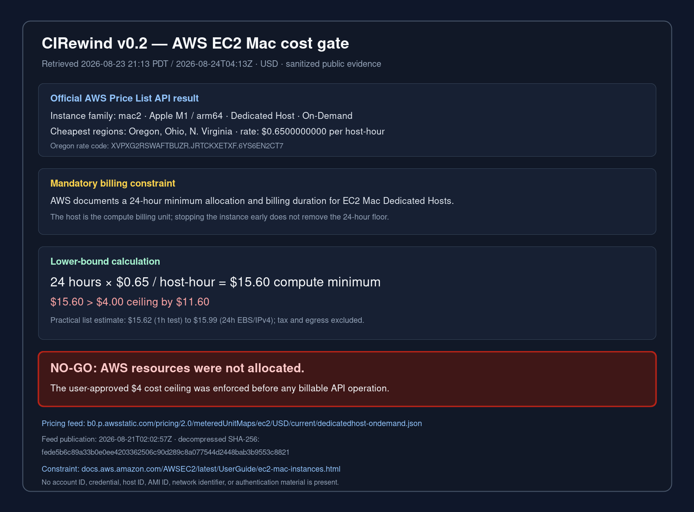

# AWS macOS qualification cost gate — 2026-08-23

Status: **NO-GO for AWS; no AWS resource was allocated**

This record applies the maintainer-approved USD 4 cost ceiling to a native
macOS 15 arm64 qualification host. It contains only public AWS pricing facts
and sanitized read-only query results. It contains no AWS account identifier,
credential, host ID, instance ID, network identifier, or authentication
material.



The SVG source for the rendered evidence is retained beside the PNG so the
text remains reviewable and reproducible.

```text
SVG SHA-256: d8f8e24e18c2d0511a3af3ea4bdf0d37f050ab039ef79407abacd9c1f8191af9
PNG SHA-256: d9fe3e440ec744569a7da786f58c13c4f4fc04953e1fe5824d5744aef0101f5e
```

## Decision

The cheapest qualifying public On-Demand rate found for an Apple-silicon
`mac2` Dedicated Host was USD 0.65 per host-hour. AWS requires a 24-hour
minimum allocation and billing duration for an EC2 Mac Dedicated Host.

```text
24 host-hours × USD 0.65 / host-hour = USD 15.60
USD 15.60 - USD 4.00 ceiling = USD 11.60 over ceiling
```

Compute alone therefore exceeds the approved ceiling. The calculation is an
intentional lower bound: EBS, public IPv4, data transfer, tax, and support
charges are omitted because none can make the public list-price result lower.
No credits, private discount, or pre-existing Savings Plan is assumed. Even
the AWS-documented maximum 44% Savings Plans reduction would leave the compute
floor at USD 8.736.

A practical public-list estimate, still excluding tax and outbound transfer,
is:

| Assumption | Host | 100 GiB gp3 | One public IPv4 | Estimated total |
| --- | ---: | ---: | ---: | ---: |
| One-hour instance/test lifecycle; host remains billable for 24 hours | $15.60 | $0.0111 | $0.005 | **$15.62** |
| Volume, address, and host all retained for 24 hours | $15.60 | $0.2667 | $0.12 | **$15.99** |

The storage estimate uses the AWS gp3 example rate of USD 0.08 per GB-month
and AWS's 30-day example denominator. The address estimate uses the current USD
0.005 per address-hour rate. The test does not need enhanced gp3 IOPS,
snapshots, a NAT gateway, a load balancer, or cross-AZ traffic.

No allocation, instance launch, volume creation, address allocation, security
group change, key-pair creation, or other billable/mutating AWS call was made.

## Primary-source evidence

Sources were retrieved at `2026-08-24T04:13:23Z`.

1. AWS documents that the Dedicated Host is the billing unit and that EC2 Mac
   has a 24-hour minimum allocation period:
   [Amazon EC2 Mac instances](https://docs.aws.amazon.com/AWSEC2/latest/UserGuide/ec2-mac-instances.html#mac-instance-considerations).
2. AWS separately states that On-Demand EC2 Mac Dedicated Hosts have a 24-hour
   minimum allocation and billing duration:
   [EC2 Dedicated Host pricing](https://aws.amazon.com/ec2/dedicated-hosts/pricing/).
3. AWS identifies `mac2.metal` as Apple M1 hardware suitable for an arm64 macOS
   lane:
   [Amazon EC2 Mac instances](https://docs.aws.amazon.com/AWSEC2/latest/UserGuide/ec2-mac-instances.html).
4. AWS lists macOS Sequoia 15 for all Mac instances and Homebrew among the
   default EC2 macOS AMI packages:
   [EC2 macOS AMI release notes](https://docs.aws.amazon.com/AWSEC2/latest/UserGuide/macos-ami-overview.html).
5. The current public AWS metered-unit feed supplied the regional rates:
   [Dedicated Host On-Demand pricing feed](https://b0.p.awsstatic.com/pricing/2.0/meteredUnitMaps/ec2/USD/current/dedicatedhost-ondemand.json).
6. The ancillary estimate uses AWS's current
   [EBS gp3 pricing example](https://aws.amazon.com/ebs/pricing/)
   and [public IPv4 rate](https://aws.amazon.com/vpc/pricing/).

The decompressed pricing feed recorded:

```text
hawkFilePublicationDate: 2026-08-21T02:02:57Z
currencyCode: USD
SHA-256: fede5b6c89a33b0e0ee4203362506c90d289c8a077544d2448bab3b9553c8821

US West (Oregon)       0.6500000000  XVPXG2RSWAFTBUZR.JRTCKXETXF.6YS6EN2CT7
US East (Ohio)         0.6500000000  FHBQ5AGWE6A8TBDJ.JRTCKXETXF.6YS6EN2CT7
US East (N. Virginia)  0.6500000000  V6UR2G74QTABQPH7.JRTCKXETXF.6YS6EN2CT7
EU (Ireland)           0.7160000000  DKZ8FWVPY3U92NDW.JRTCKXETXF.6YS6EN2CT7
Asia Pacific (Singapore) 0.7790000000 HEPF7VJ5BBCCWBWU.JRTCKXETXF.6YS6EN2CT7
```

The independently queried AWS Price List API returned the same USD 0.65
`mac2` host rate in the three lowest-price Regions. Pricing and documentation
queries were read-only. A sanitized read-only inventory check found no already
allocated EC2 Mac host that could provide a zero-marginal-cost lane; that
account-specific response is deliberately not retained in the repository.

## Zero-cost qualification path

The public CIRewind repository already has an active `workflow_dispatch`
workflow and a `macos-15` matrix lane. GitHub documents `macos-15` as a standard
arm64 M1 runner and states that standard GitHub-hosted runners are free and
unlimited for public repositories:
[GitHub-hosted runners reference](https://docs.github.com/en/actions/reference/runners/github-hosted-runners#standard-github-hosted-runners-for-public-repositories).

That path has an estimated platform charge of USD 0. It can qualify the exact
Batch 1 bytes only after those bytes exist at an authorized remote ref. This
cost decision does not authorize a push, workflow dispatch, pull request, or
release, and it does not mark `ADO-015` complete.

The local candidate includes `scripts/qualify_demo.py` and a narrowly scoped
`darwin-arm64` CI step. The harness builds the candidate binary outside the
checkout, invokes five clean demos with credentials omitted, proxies poisoned,
an unusable `PATH`, and per-trial home/cache directories, independently verifies
every case, byte-compares all required outputs, and enforces the accepted
`T_demo` thresholds. The hosted result is bound to the lowercase full source
commit and candidate-binary SHA-256. Its Linux regression passed locally; no
native macOS result is claimed until the public hosted job runs against the
exact remote object.

## Reproduction

The rate check can be repeated without creating a resource:

```sh
aws pricing get-products \
  --region us-east-1 \
  --service-code AmazonEC2 \
  --filters \
    Type=TERM_MATCH,Field=instanceType,Value=mac2 \
    Type=TERM_MATCH,Field=capacitystatus,Value=AllocatedHost \
    Type=TERM_MATCH,Field=location,Value='US West (Oregon)'
```

The public feed can be downloaded independently and its decompressed bytes
checked against the recorded SHA-256. Future qualification must repeat the rate
check because AWS prices and runner offerings can change.
